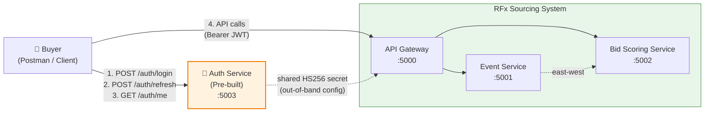
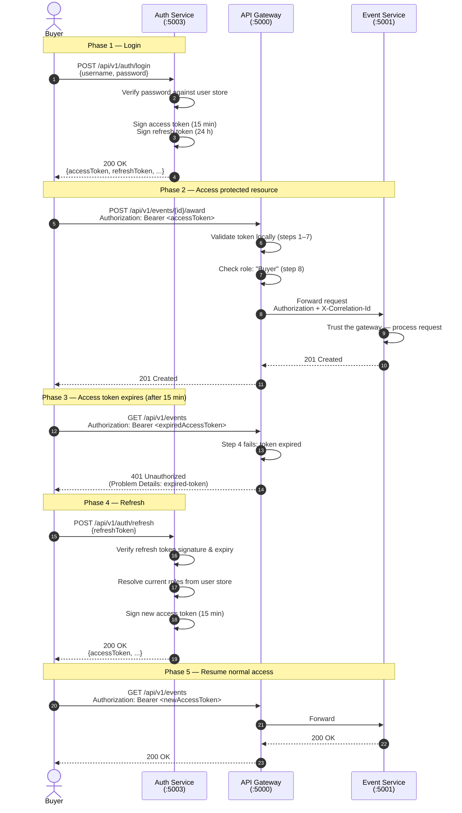

# Auth Service Specification

## RFx Sourcing Event Management

---

### Document Control

| Field             | Value                                                                |
| ----------------- | -------------------------------------------------------------------- |
| Document Title    | Auth Service Specification — RFx Sourcing Event Management           |
| Version           | 0.1 (Draft)                                                          |
| Status            | For Technical Review                                                 |
| Author            | Ramkumar (Solution Architect)                                        |
| Date              | 04 May 2026                                                          |
| Related Artefacts | BRD v0.1, HLD v0.1, ADR 0005, ADR 0006                               |
| Intended Audience | Development Team, Test Team, Solution Architects                     |
| Build Scope       | **Pre-built / Out of scope for the demo build**                      |

---

## Table of Contents

1. [Document Purpose](#1-document-purpose)
2. [Position Within the System](#2-position-within-the-system)
3. [Consumers of the Auth Service](#3-consumers-of-the-auth-service)
4. [Endpoint Inventory](#4-endpoint-inventory)
5. [Endpoint Specifications](#5-endpoint-specifications)
6. [JWT Structure](#6-jwt-structure)
7. [Refresh Token Strategy](#7-refresh-token-strategy)
8. [Error Response Contract](#8-error-response-contract)
9. [Gateway JWT Validation Behaviour](#9-gateway-jwt-validation-behaviour)
10. [End-to-End Authentication Lifecycle](#10-end-to-end-authentication-lifecycle)
11. [Configuration & Shared Secrets](#11-configuration--shared-secrets)
12. [Security Considerations](#12-security-considerations)
13. [Out of Scope](#13-out-of-scope)

---

## 1. Document Purpose

This document specifies the **Auth Service** that issues JSON Web Tokens (JWTs) consumed by the RFx Sourcing Event Management system. It defines the endpoint surface, request and response contracts, the structure of issued tokens, and the gateway's validation behaviour.

The Auth Service is **pre-built and out of scope** for the 12-hour demo build. This specification exists so that:

- The development team understands what the Auth Service contract looks like, even though they will not implement it during the demo.
- The gateway and downstream services can be configured to consume tokens compatible with this contract.
- Reviewing architects can validate that the auth design is internally consistent with the rest of the HLD.

Concrete database schemas, password hashing algorithms, and operational deployment details are out of scope.

---

## 2. Position Within the System

The Auth Service is an **external pre-built dependency**. It runs as a separate process (port `5003` for local demonstration) and is **not part of the mono-repo** for the RFx system. It exposes a small REST API and is consumed by the Buyer (the client) and indirectly trusted by the API Gateway through a shared signing secret.



**Key principle:** the Auth Service and the API Gateway share an HS256 signing secret at configuration time. The gateway validates tokens **locally** using this secret — there is **no live call from the gateway to the Auth Service** on every request.

---

## 3. Consumers of the Auth Service

| Consumer            | Interaction                                                                      |
| ------------------- | -------------------------------------------------------------------------------- |
| Buyer (Client)      | Calls `POST /auth/login` to obtain access + refresh tokens. Calls `POST /auth/refresh` when the access token expires. Optionally calls `GET /auth/me` to inspect the current user. |
| API Gateway         | **Does not call the Auth Service at runtime.** Validates JWTs locally using the shared HS256 secret. The shared secret is provided to the gateway via configuration. |
| Event Service       | **Does not interact with the Auth Service.** Trusts the gateway per ADR 0006.    |
| Bid Scoring Service | **Does not interact with the Auth Service.** Trusts the gateway per ADR 0006.    |

This is consistent with the locked decision in ADR 0006 (JWT validation at gateway only). Production hardening would introduce per-service token re-validation, at which point those services would also need access to the shared secret (or, preferably, a public key in an RS256 model).

---

## 4. Endpoint Inventory

| #   | Method | Path                | Authentication Required | Purpose                                          |
| --- | ------ | ------------------- | ------------------------ | ------------------------------------------------ |
| E1  | POST   | `/auth/login`       | None                     | Authenticate username + password; issue tokens.  |
| E2  | POST   | `/auth/refresh`     | Refresh Token in body    | Issue a new access token from a valid refresh.   |
| E3  | GET    | `/auth/me`          | Bearer Access Token      | Return the authenticated user's profile claims.  |
| E4  | GET    | `/health`           | None                     | Liveness probe.                                  |

All endpoints are versioned under `/api/v1/...` consistent with the rest of the system (ADR 0004), giving the actual paths:

- `POST /api/v1/auth/login`
- `POST /api/v1/auth/refresh`
- `GET  /api/v1/auth/me`
- `GET  /api/v1/health`

---

## 5. Endpoint Specifications

### 5.1 E1 — `POST /api/v1/auth/login`

**Purpose:** Authenticate a buyer using username and password. Issue an access token (short-lived) and a refresh token (long-lived).

**Request**

| Aspect          | Value                                                                |
| --------------- | -------------------------------------------------------------------- |
| Headers         | `Content-Type: application/json`                                     |
| Body Schema     | See below                                                            |

**Request Body:**

```json
{
  "username": "ramkumar.buyer",
  "password": "P@ssw0rd!"
}
```

**Field semantics:**

| Field      | Type   | Required | Notes                                     |
| ---------- | ------ | -------- | ----------------------------------------- |
| `username` | string | Yes      | Unique within the Auth Service user base. |
| `password` | string | Yes      | Plaintext over HTTPS; verified against stored hash. |

**Response — 200 OK (success)**

```json
{
  "accessToken": "eyJhbGciOiJIUzI1NiIs...",
  "refreshToken": "eyJhbGciOiJIUzI1NiIs...",
  "tokenType": "Bearer",
  "accessTokenExpiresInSeconds": 900,
  "refreshTokenExpiresInSeconds": 86400
}
```

**Field semantics:**

| Field                          | Type    | Notes                                                   |
| ------------------------------ | ------- | ------------------------------------------------------- |
| `accessToken`                  | string  | HS256-signed JWT (see §6).                              |
| `refreshToken`                 | string  | HS256-signed JWT, longer expiry (see §7).               |
| `tokenType`                    | string  | Constant: `"Bearer"`.                                   |
| `accessTokenExpiresInSeconds`  | integer | Indicative client hint; canonical expiry is in `exp`.   |
| `refreshTokenExpiresInSeconds` | integer | Indicative client hint; canonical expiry is in `exp`.   |

**Response — 401 Unauthorized (invalid credentials)**

Per ADR 0005 (RFC 7807 Problem Details):

```json
{
  "type": "https://rfx.gep.local/probs/invalid-credentials",
  "title": "Invalid credentials",
  "status": 401,
  "detail": "Username or password is incorrect.",
  "instance": "/api/v1/auth/login",
  "correlationId": "abc-123"
}
```

**Response — 400 Bad Request (validation failure)**

Returned when `username` or `password` is missing or empty.

```json
{
  "type": "https://rfx.gep.local/probs/validation-error",
  "title": "Validation error",
  "status": 400,
  "detail": "username and password are required.",
  "instance": "/api/v1/auth/login",
  "correlationId": "abc-124"
}
```

---

### 5.2 E2 — `POST /api/v1/auth/refresh`

**Purpose:** Exchange a valid refresh token for a new access token.

**Request**

| Aspect          | Value                                                                |
| --------------- | -------------------------------------------------------------------- |
| Headers         | `Content-Type: application/json`                                     |
| Body Schema     | See below                                                            |

**Request Body:**

```json
{
  "refreshToken": "eyJhbGciOiJIUzI1NiIs..."
}
```

**Response — 200 OK (success)**

```json
{
  "accessToken": "eyJhbGciOiJIUzI1NiIs...",
  "tokenType": "Bearer",
  "accessTokenExpiresInSeconds": 900
}
```

**Note:** in this design the Auth Service does **not** rotate the refresh token on each refresh (the same refresh token continues to be valid until its own expiry). Refresh-token rotation is a production hardening considered out of scope.

**Response — 401 Unauthorized (refresh token invalid or expired)**

```json
{
  "type": "https://rfx.gep.local/probs/invalid-refresh-token",
  "title": "Invalid or expired refresh token",
  "status": 401,
  "detail": "The supplied refresh token is invalid, malformed, or has expired.",
  "instance": "/api/v1/auth/refresh",
  "correlationId": "abc-125"
}
```

---

### 5.3 E3 — `GET /api/v1/auth/me`

**Purpose:** Return the profile and claims of the user identified by the access token. Useful for the client to inspect "who am I" without decoding the JWT manually.

**Request**

| Aspect    | Value                                                                |
| --------- | -------------------------------------------------------------------- |
| Headers   | `Authorization: Bearer <access_token>`                               |
| Body      | None                                                                 |

**Response — 200 OK (success)**

```json
{
  "userId": "8f3b2c1a-1d4e-4a5b-9c7d-2e6f8a0b1c2d",
  "username": "ramkumar.buyer",
  "roles": ["Buyer"],
  "tokenIssuedAt": "2026-05-04T10:15:30Z",
  "tokenExpiresAt": "2026-05-04T10:30:30Z"
}
```

**Field semantics:**

| Field             | Type        | Notes                                                |
| ----------------- | ----------- | ---------------------------------------------------- |
| `userId`          | string/UUID | Same value as the JWT `sub` claim.                   |
| `username`        | string      | Display username.                                    |
| `roles`           | string[]    | Same value as the JWT `roles` claim.                 |
| `tokenIssuedAt`   | string/ISO 8601 | Convenience; derived from JWT `iat`.             |
| `tokenExpiresAt`  | string/ISO 8601 | Convenience; derived from JWT `exp`.             |

**Response — 401 Unauthorized (missing or invalid access token)**

Same Problem Details shape as §5.1.

---

### 5.4 E4 — `GET /api/v1/health`

**Purpose:** Liveness probe. Used by smoke-test scripts.

**Request:** No body, no auth.

**Response — 200 OK**

```json
{
  "status": "UP",
  "service": "auth-service",
  "timestamp": "2026-05-04T10:15:30Z"
}
```

---

## 6. JWT Structure

### 6.1 Signing Algorithm

- **Algorithm:** `HS256` (HMAC-SHA256, symmetric).
- **Secret:** A pre-shared string held by both the Auth Service (for signing) and the Gateway (for validation). Configured via `appsettings.json` for the demo (see §11 and §12).

### 6.2 Access Token Claims

The access token JWT carries the following claims:

| Claim    | Purpose                                                          | Required | Example                                       |
| -------- | ---------------------------------------------------------------- | -------- | --------------------------------------------- |
| `sub`    | Unique user identifier (matches `userId` in user store).         | Yes      | `"8f3b2c1a-1d4e-4a5b-9c7d-2e6f8a0b1c2d"`      |
| `iat`    | Issued-at timestamp (Unix epoch seconds).                        | Yes      | `1714817730`                                  |
| `exp`    | Expiry timestamp (Unix epoch seconds). Typically `iat + 900`.    | Yes      | `1714818630`                                  |
| `roles`  | Array of role strings.                                           | Yes      | `["Buyer"]`                                   |
| `iss`    | Issuer — string identifying the Auth Service.                    | Yes      | `"rfx-auth-service"`                          |
| `aud`    | Audience — string identifying the consuming system.              | Yes      | `"rfx-sourcing-system"`                       |
| `tokenType` | Custom claim distinguishing access vs refresh tokens.         | Yes      | `"access"`                                    |

**Decoded sample payload:**

```json
{
  "sub": "8f3b2c1a-1d4e-4a5b-9c7d-2e6f8a0b1c2d",
  "iat": 1714817730,
  "exp": 1714818630,
  "iss": "rfx-auth-service",
  "aud": "rfx-sourcing-system",
  "tokenType": "access",
  "roles": ["Buyer"]
}
```

### 6.3 Refresh Token Claims

The refresh token is also a JWT, signed with the same HS256 secret but with a longer expiry and a `tokenType` of `"refresh"`:

```json
{
  "sub": "8f3b2c1a-1d4e-4a5b-9c7d-2e6f8a0b1c2d",
  "iat": 1714817730,
  "exp": 1714904130,
  "iss": "rfx-auth-service",
  "aud": "rfx-sourcing-system",
  "tokenType": "refresh"
}
```

**Note:** the refresh token does **not** carry `roles`. Roles are resolved fresh from the user store at refresh time, ensuring role changes take effect at the next refresh.

### 6.4 Token Lifetimes (Indicative)

| Token Type     | Lifetime       |
| -------------- | -------------- |
| Access Token   | 15 minutes (900 seconds) |
| Refresh Token  | 24 hours (86400 seconds) |

These are configurable in the Auth Service. The values above are sensible defaults for the demo.

---

## 7. Refresh Token Strategy

The Auth Service uses a **stateless refresh token model** consistent with our locked decision (D7 in this document corresponds to the auth-side simplification):

- Refresh tokens are JWTs themselves, signed with HS256.
- The Auth Service **does not store** issued refresh tokens server-side.
- Validation at `/auth/refresh` is purely cryptographic: signature valid, not expired, `tokenType: "refresh"`, `iss` and `aud` match.
- Upon successful refresh, a **new access token** is issued; the **same refresh token** continues to be valid until its own expiry.

### Trade-offs

**Positive:**
- Auth Service is operationally simple — no token store, no revocation list.
- Horizontally scalable without distributed state.

**Negative:**
- **Logout cannot truly invalidate a refresh token.** A client can only delete it locally.
- A leaked refresh token grants new access tokens until its own expiry.

This is acceptable for the demo. Production hardening (denylist, sliding rotation, server-side storage) is documented as out of scope.

---

## 8. Error Response Contract

All error responses from the Auth Service conform to **RFC 7807 Problem Details** (per ADR 0005). The shape:

```json
{
  "type": "https://rfx.gep.local/probs/<problem-slug>",
  "title": "Short human-readable summary",
  "status": <http_status_code>,
  "detail": "Longer explanation suitable for end users",
  "instance": "<request_path>",
  "correlationId": "<correlation_id>"
}
```

### Error Catalogue

| HTTP Status | `type` slug                | When                                              |
| ----------- | -------------------------- | ------------------------------------------------- |
| 400         | `validation-error`         | Required fields missing or empty.                 |
| 401         | `invalid-credentials`      | `/auth/login` with wrong username or password.    |
| 401         | `invalid-access-token`     | `/auth/me` with missing, malformed, or expired access token. |
| 401         | `invalid-refresh-token`    | `/auth/refresh` with missing, malformed, or expired refresh token. |
| 500         | `internal-error`           | Unexpected server failure.                        |

---

## 9. Gateway JWT Validation Behaviour

This section describes how the API Gateway consumes tokens issued by the Auth Service. It does **not** describe Auth Service behaviour; it describes the **gateway's** behaviour to make the contract end-to-end clear.

### 9.1 Validation Steps

For every inbound request to a protected route, the gateway performs the following checks **in order**:

1. **Header presence** — does the request carry an `Authorization: Bearer <token>` header? If not → `401 Unauthorized` with `type: missing-token`.
2. **Token format** — is the value a syntactically valid JWT (three base64url segments)? If not → `401 Unauthorized` with `type: malformed-token`.
3. **Signature** — does the HS256 signature verify against the shared secret? If not → `401 Unauthorized` with `type: invalid-signature`.
4. **Expiry (`exp`)** — has the token expired (current time ≥ `exp`)? If yes → `401 Unauthorized` with `type: expired-token`.
5. **Issuer (`iss`)** — does it match the configured expected issuer (`"rfx-auth-service"`)? If not → `401 Unauthorized` with `type: invalid-issuer`.
6. **Audience (`aud`)** — does it match the configured expected audience (`"rfx-sourcing-system"`)? If not → `401 Unauthorized` with `type: invalid-audience`.
7. **Token type** — is `tokenType` equal to `"access"`? (Reject refresh tokens used in place of access tokens.) If not → `401 Unauthorized` with `type: invalid-token-type`.
8. **Role check (Award endpoint only)** — does `roles` contain `"Buyer"`? If not → `403 Forbidden` with `type: insufficient-role`.

If all checks pass, the gateway forwards the request to the appropriate downstream service, propagating:

- The original `Authorization` header (downstream services trust but do not re-validate per ADR 0006).
- The `X-Correlation-Id` header (per HLD §11.2).

### 9.2 What the Gateway Does NOT Do

- It does **not** call the Auth Service at runtime. Validation is entirely local using the shared secret.
- It does **not** decode or modify the token payload before forwarding (the downstream services receive the original bearer token).
- It does **not** check token revocation. Revocation is out of scope for this release.

### 9.3 Configuration the Gateway Needs

| Setting                 | Source                  | Example                          |
| ----------------------- | ----------------------- | -------------------------------- |
| `Jwt:SigningKey`        | `appsettings.json`      | (shared secret string)           |
| `Jwt:Issuer`            | `appsettings.json`      | `"rfx-auth-service"`             |
| `Jwt:Audience`          | `appsettings.json`      | `"rfx-sourcing-system"`          |
| `Jwt:ClockSkewSeconds`  | `appsettings.json`      | `30` (tolerance for `exp`/`iat`) |

---

## 10. End-to-End Authentication Lifecycle



---

## 11. Configuration & Shared Secrets

For the demo environment, the following configuration values are shared between the Auth Service and the API Gateway:

### Auth Service Configuration

```json
{
  "Jwt": {
    "SigningKey": "<32+ char random string>",
    "Issuer": "rfx-auth-service",
    "Audience": "rfx-sourcing-system",
    "AccessTokenLifetimeSeconds": 900,
    "RefreshTokenLifetimeSeconds": 86400
  }
}
```

### Gateway Configuration

```json
{
  "Jwt": {
    "SigningKey": "<must match Auth Service>",
    "Issuer": "rfx-auth-service",
    "Audience": "rfx-sourcing-system",
    "ClockSkewSeconds": 30
  }
}
```

**Critical:** the `SigningKey` must be **identical** in both components. Any mismatch will cause every token to fail signature validation at the gateway.

---

## 12. Security Considerations

This section enumerates known security limitations and the production mitigations that would address each.

| #  | Limitation                                                                         | Production Mitigation                                                              |
| -- | ---------------------------------------------------------------------------------- | ---------------------------------------------------------------------------------- |
| S1 | Signing secret is stored in `appsettings.json` (per ADR 0006 / Risk R6).           | Move to a secrets manager (Azure Key Vault, AWS Secrets Manager, HashiCorp Vault). |
| S2 | HS256 (symmetric) means every component holding the secret can forge tokens.       | Switch to RS256 (asymmetric); Auth Service holds the private key, gateway holds only the public key. |
| S3 | No refresh token revocation; logout is client-side only.                           | Server-side refresh token store with revocation list.                              |
| S4 | Passwords are sent in plaintext over HTTP/JSON (HTTPS assumed in deployment).      | Enforce HTTPS at the perimeter; consider mutual TLS for internal traffic.          |
| S5 | No protection against credential stuffing or brute-force on `/auth/login`.         | Rate limiting + account lockout policies + CAPTCHA on repeated failures.           |
| S6 | Refresh tokens are not rotated on each refresh.                                    | Implement refresh token rotation with replay detection.                            |
| S7 | Gateway validates JWT but downstream services do not (per ADR 0006).               | Per-service JWT validation as defence in depth.                                    |
| S8 | No password complexity or expiry policy specified at this layer.                   | Define and enforce policy in the Auth Service user management module.              |

---

## 13. Out of Scope

The following are **not** part of this specification:

- User registration and self-service password reset.
- Multi-factor authentication (MFA / 2FA).
- Single sign-on (SSO) integration with external identity providers (SAML, OIDC federation).
- Account lockout, password complexity, password expiry policies.
- Audit logging of authentication events at the Auth Service.
- Refresh token rotation, denylist, or revocation endpoints.
- Token introspection endpoint (`/introspect`).
- OpenID Connect Discovery (`/.well-known/openid-configuration`).
- JWKS endpoint (`/.well-known/jwks.json`) — only relevant for asymmetric signing (RS256).
- Multi-tenant or multi-organisation support.
- Per-service token re-validation (deferred to a future release per ADR 0006).

---

### Document History

| Version | Date        | Author    | Notes                                  |
| ------- | ----------- | --------- | -------------------------------------- |
| 0.1     | 04 May 2026 | Ramkumar  | Initial draft for technical review.    |

---

*End of Document*
