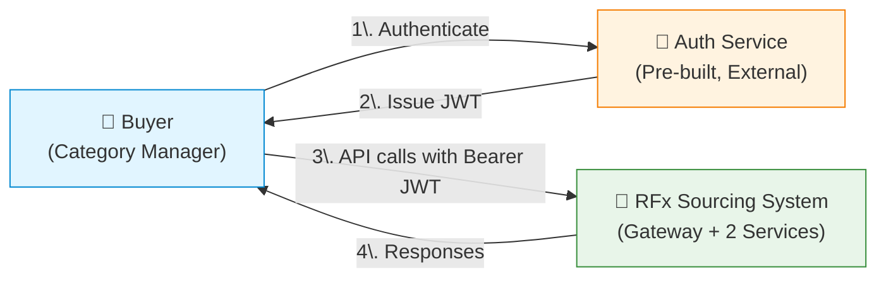
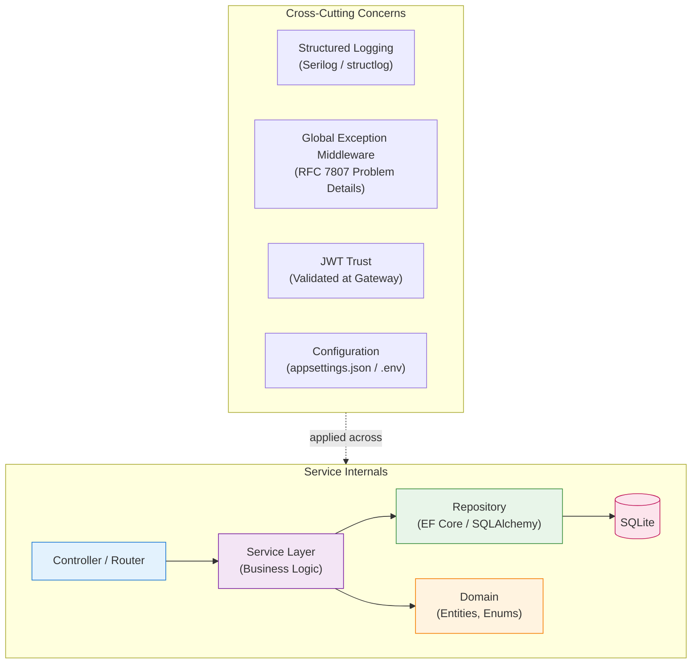
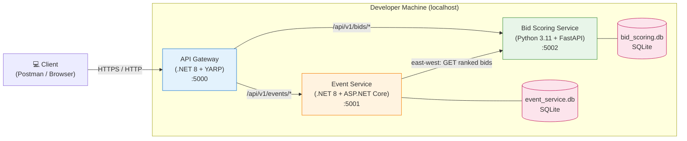
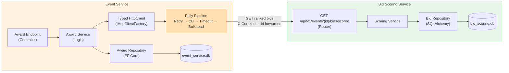
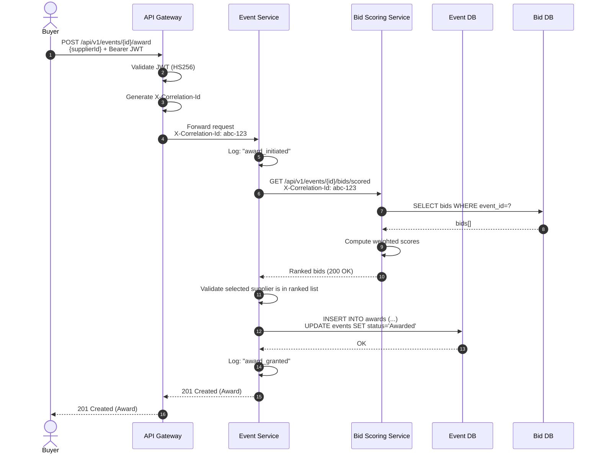
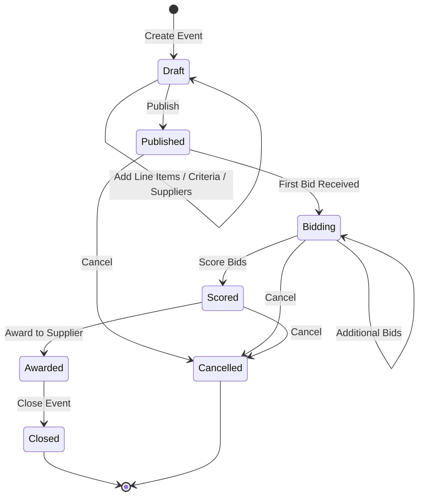
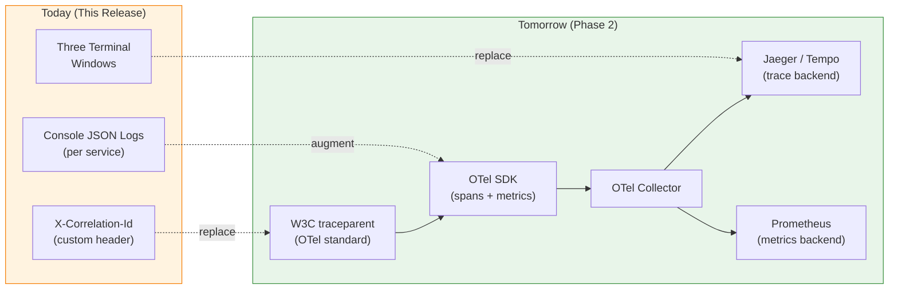

# High-Level Design (HLD)

## RFx Sourcing Event Management

---

### Document Control

| Field             | Value                                                                |
| ----------------- | -------------------------------------------------------------------- |
| Document Title    | HLD — RFx Sourcing Event Management                                  |
| Version           | 0.1 (Draft)                                                          |
| Status            | For Technical Review                                                 |
| Author            | Ramkumar (Solution Architect)                                        |
| Date              | 04 May 2026                                                          |
| Related Artefacts | BRD — RFx Sourcing Event Management v0.1                             |
| Intended Audience | Development Team, Test Team, Solution Architects, Technical Leads    |
| Project Type      | Greenfield                                                           |

---

## Table of Contents

1. [Document Purpose](#1-document-purpose)
2. [Solution Overview](#2-solution-overview)
3. [Technology Stack](#3-technology-stack)
4. [System Context](#4-system-context)
5. [Architectural Style](#5-architectural-style)
6. [Deployment View](#6-deployment-view)
7. [Component Views](#7-component-views)
8. [Inter-Service Communication](#8-inter-service-communication)
9. [Security Architecture](#9-security-architecture)
10. [Data Architecture](#10-data-architecture)
11. [Cross-Cutting Concerns](#11-cross-cutting-concerns)
12. [Repository & Project Structure](#12-repository--project-structure)
13. [Build, Run, and Local Developer Experience](#13-build-run-and-local-developer-experience)
14. [Testing Strategy](#14-testing-strategy)
15. [Versioning, Evolution, and Extensibility](#15-versioning-evolution-and-extensibility)
16. [Feature Traceability Matrix](#16-feature-traceability-matrix)
17. [Architectural Assumptions](#17-architectural-assumptions)
18. [Risks Register](#18-risks-register)
19. [ADR Index](#19-adr-index)
20. [Glossary](#20-glossary)

---

## 1. Document Purpose

This document presents the **High-Level Design (HLD)** for the RFx Sourcing Event Management capability described in the BRD. It is intended to give the development team, test team, and reviewing architects a clear understanding of:

- The technology stack and the rationale for each choice.
- The architectural style and service boundaries.
- The runtime topology, inter-service communication, and contract strategy.
- Cross-cutting concerns — security, logging, error handling, configuration, observability.
- Repository, project, and folder conventions.
- Build, run, and testing strategy at the architectural level.
- Risks, assumptions, and the architectural decisions that have been formally recorded.

Concrete REST endpoint shapes, request/response payloads, database schemas, and algorithmic detail are deferred to the **Low-Level Design (LLD)** and **API Specification** artefacts.

---

## 2. Solution Overview

The capability is delivered as a small distributed system comprising:

- An **API Gateway** acting as the single client-facing entry point.
- An **Event Service** owning the sourcing event lifecycle (create, invite suppliers, publish, award).
- A **Bid Scoring Service** owning supplier bids, scoring criteria, and ranked recommendations.
- A pre-built **Auth Service** issuing JWTs (out of scope for this build).

Services are independently deployable, own their own data, and communicate over synchronous REST/JSON. Client traffic flows north-south through the gateway; service-to-service traffic flows east-west directly between services.

The solution is greenfield. No legacy systems, brownfield integrations, or migration paths are in scope.

---

## 3. Technology Stack

### 3.1 Runtime & Frameworks

| Component                | Technology                              | Rationale                                                                                  |
| ------------------------ | --------------------------------------- | ------------------------------------------------------------------------------------------ |
| API Gateway              | .NET 8 + YARP                           | Lightweight reverse proxy, native to .NET ecosystem, simple configuration, no Docker needed. |
| Event Service            | .NET 8 + ASP.NET Core Web API           | Mainstream enterprise .NET; strong tooling; aligns with mixed-stack microservice demonstration. |
| Bid Scoring Service      | Python 3.11 + FastAPI                   | Modern Python web framework; excellent for compute-style workloads (scoring); native OpenAPI. |
| Auth Service             | Pre-built (out of scope)                | Issues JWTs; not part of this build.                                                       |

### 3.2 Persistence

| Component                | Technology                              | Rationale                                                                                  |
| ------------------------ | --------------------------------------- | ------------------------------------------------------------------------------------------ |
| Database (per service)   | SQLite (file-based)                     | Zero-install, demonstrable database-per-service pattern, sufficient for demo workloads.    |
| ORM (.NET)               | Entity Framework Core 8                 | Mainstream .NET ORM, integrated migrations, idiomatic.                                     |
| ORM (Python)             | SQLAlchemy 2.x (sync)                   | De facto Python ORM standard; sync mode chosen due to known SQLite + async quirks.         |
| Migrations (.NET)        | EF Core Migrations                      | First-class migration tooling.                                                             |
| Migrations (Python)      | Alembic                                 | Standard SQLAlchemy migration companion.                                                   |

### 3.3 Cross-Cutting Libraries

| Concern                   | .NET                                   | Python                                  |
| ------------------------- | -------------------------------------- | --------------------------------------- |
| Structured Logging        | Serilog (JSON sink → stdout)           | structlog (JSON renderer → stdout)      |
| Configuration             | `appsettings.json` + `IOptions<T>`     | `pydantic-settings` + `.env`            |
| Validation                | Built-in Data Annotations + FluentValidation (optional) | Pydantic v2                  |
| HTTP Client (East-West)   | `IHttpClientFactory` named clients     | `httpx` (sync)                          |
| Resilience                | Polly (Retry + CB + Timeout + Bulkhead)| —                                       |
| Health Checks             | `Microsoft.Extensions.Diagnostics.HealthChecks` | FastAPI router endpoint        |

### 3.4 Testing

| Layer                | .NET                                   | Python                                  |
| -------------------- | -------------------------------------- | --------------------------------------- |
| Unit                 | xUnit + Moq                            | pytest + pytest-mock                    |
| Integration          | `WebApplicationFactory` + SQLite test DB | FastAPI `TestClient` + SQLite test DB |
| End-to-End (happy)   | xUnit hitting gateway over HTTP        | —                                       |
| End-to-End (errors)  | Postman collection (manual / Newman)   | —                                       |

### 3.5 Tooling & Developer Experience

| Tool                 | Role                                                                            |
| -------------------- | ------------------------------------------------------------------------------- |
| VS Code              | Primary IDE.                                                                    |
| Claude Code          | AI-assisted coding agent for spec-driven development.                           |
| PowerShell Core      | Cross-platform scripting for run/seed/clean/smoke-test scripts.                 |
| Postman              | API exploration and demo surface; collection committed to repo.                 |
| Git                  | Source control; mono-repo strategy.                                             |

---

## 4. System Context

### 4.1 System Context Diagram



### 4.2 Actors

| Actor              | Description                                                              |
| ------------------ | ------------------------------------------------------------------------ |
| Buyer              | The Category Manager who runs sourcing events end-to-end.                |
| Auth Service       | External, pre-built identity provider issuing JWTs. Out of build scope.  |
| RFx Sourcing System| The system being designed in this document.                              |

---

## 5. Architectural Style

### 5.1 Style Selection

The system adopts a **microservices architecture** with two services and an API gateway, communicating via **synchronous REST/JSON**. Within each service, a **layered (N-tier) architecture** is used.

### 5.2 Service Boundaries

| Service             | Owns                                                                | Does Not Own                                          |
| ------------------- | ------------------------------------------------------------------- | ----------------------------------------------------- |
| Event Service       | Events, line items, suppliers, invitations, awards.                 | Bids, scoring criteria.                               |
| Bid Scoring Service | Bids, scoring criteria, scoring computation, ranked results.        | Events, suppliers, awards.                            |

The boundary is **strict**: neither service reads the other's database. All cross-service data is exchanged via the other service's REST API.

### 5.3 Internal Layered Architecture

Both services adopt a four-layer structure:

| Layer            | Responsibility                                                                |
| ---------------- | ----------------------------------------------------------------------------- |
| Controller / Router | HTTP entry point; request validation; status code mapping.                |
| Service          | Business logic, orchestration, transaction boundaries.                       |
| Repository       | Persistence abstraction; ORM access.                                         |
| Domain           | Entities, value objects, enumerations.                                       |



---

## 6. Deployment View

### 6.1 Runtime Topology

All components run as separate processes on a single developer machine. No containerisation in this release.



### 6.2 Port Allocation

| Component             | Port  | Notes                                                             |
| --------------------- | ----- | ----------------------------------------------------------------- |
| API Gateway           | 5000  | Single client-facing endpoint.                                    |
| Event Service         | 5001  | Internal; reachable directly during local development only.       |
| Bid Scoring Service   | 5002  | Internal; reachable directly during local development only.       |

### 6.3 Service Discovery

Static configuration in `gateway/appsettings.json`. No service registry, no DNS-based discovery, no environment-based fallback. Suitable for local execution only.

---

## 7. Component Views

### 7.1 North-South Request Flow (Client → Service)

```mermaid
flowchart LR
    Client["💻 Client"]

    subgraph Gateway["API Gateway"]
        direction TB
        Auth["JWT Validation<br/>Middleware"]
        CorrId["Correlation ID<br/>Injection"]
        Logger1["Structured<br/>Request Logging"]
        Router["YARP Router"]

        Auth --> CorrId
        CorrId --> Logger1
        Logger1 --> Router
    end

    subgraph EventSvc["Event Service"]
        direction TB
        Pipeline["ASP.NET Core Pipeline<br/>(Logging, Errors)"]
        Ctrl["Controller"]
        Svc["Service Layer"]
        Repo["Repository (EF Core)"]
        DB1[("SQLite")]

        Pipeline --> Ctrl --> Svc --> Repo --> DB1
    end

    Client -->|Bearer JWT| Auth
    Router -->|"X-Correlation-Id<br/>(JWT trusted, not re-validated)"| Pipeline

    style Gateway fill:#e3f2fd,stroke:#1976d2
    style EventSvc fill:#fff3e0,stroke:#f57c00
```



**Key points:**

- JWT is validated **only** at the gateway (defence-in-depth deferred; see Risks §18).
- A unique `X-Correlation-Id` is generated per inbound request and propagated.
- All requests/responses are logged in structured JSON at the gateway and at the service.

### 7.2 East-West Service-to-Service Flow (Award Action)



**Key points:**

- Service A calls Service B's typed endpoint to fetch ranked bids before persisting the award.
- The HTTP call is wrapped in a Polly resilience pipeline (Retry → Circuit Breaker → Timeout → Bulkhead).
- Correlation ID is forwarded as a request header for end-to-end traceability.
- No distributed transaction; partial-failure semantics are documented as a risk (§18).

### 7.3 End-to-End Award Sequence



### 7.4 Event Lifecycle State Machine



**Notes:**

- `Cancelled` is included as a defensive transition though not part of the in-scope FRs; LLD will confirm whether it is implemented in this release.
- Transitions are enforced by the Service layer in the Event Service. Invalid transitions return `409 Conflict` with an RFC 7807 Problem Details body.

---

## 8. Inter-Service Communication

### 8.1 Protocol & Format

- **Protocol:** REST over HTTP/1.1.
- **Format:** JSON (`application/json`).
- **Versioning:** URL path versioning (`/api/v1/...`).
- **Error Format:** RFC 7807 Problem Details (`application/problem+json`).

### 8.2 Contract Strategy

The OpenAPI 3.x specification is the **source of truth** for each service's API and is hand-written **before** implementation. Service code is aligned to the spec. Specs live under:

```
/contracts/event-service/v1/openapi.yaml
/contracts/bid-scoring-service/v1/openapi.yaml
```

This **spec-driven development** approach pairs naturally with AI-assisted development: the OpenAPI document is a high-fidelity input to the AI agent for code generation, validation, and contract testing.

### 8.3 Typed HTTP Client (East-West)

Service A consumes Service B's API via a typed HTTP client registered through `IHttpClientFactory`. The client encapsulates:

- The base address of Service B (configured via `appsettings.json`).
- Default request headers (correlation ID propagation, content-type).
- The Polly resilience pipeline (Retry, Circuit Breaker, Timeout, Bulkhead).

### 8.4 Resilience

A Polly pipeline is configured for the east-west call. Specific thresholds (retry counts, breaker windows, timeouts, bulkhead concurrency) are deferred to LLD. **Note:** in this release the patterns are wired in code but are not exercised by demo scenarios; they are present for production-readiness and for architectural illustration. See Risks §18.

### 8.5 Versioning & Evolution

| Change Type                      | Treatment                                                           |
| -------------------------------- | ------------------------------------------------------------------- |
| New optional field in response   | Additive within `v1`; no version bump.                              |
| New endpoint                     | Additive within `v1`; no version bump.                              |
| Removed field / changed type     | Breaking; introduce `v2` and run versions in parallel.              |
| Renamed endpoint                 | Breaking; introduce `v2`.                                           |

---

## 9. Security Architecture

### 9.1 Authentication

- **Identity Provider:** Pre-built Auth Service (out of scope for this build).
- **Token Type:** JWT signed with **HS256** using a shared secret.
- **Token Transport:** `Authorization: Bearer <jwt>` header.
- **Token Lifetime & Refresh:** Auth Service responsibility; gateway and services consume access tokens only.

### 9.2 Token Validation

JWT validation occurs **at the gateway only**. Downstream services trust the gateway and do not re-validate. This is a deliberate simplification for the demo. **Implication:** services accessed directly on their internal ports are unauthenticated. This is documented as a risk (§18) with the production mitigation being either per-service JWT re-validation (defence in depth) or network-level isolation (mTLS, service mesh).

### 9.3 Claims Model

The JWT carries the following claims (LLD will confirm exact names and shapes):

| Claim   | Purpose                                                                    |
| ------- | -------------------------------------------------------------------------- |
| `sub`   | The unique identifier of the authenticated buyer.                          |
| `exp`   | Expiry timestamp.                                                          |
| `roles` | Role list, e.g., `["Buyer"]`.                                              |

### 9.4 Authorisation

Authentication-only is enforced on **most** endpoints. The **Award endpoint** is additionally gated by a role check (`[Authorize(Roles = "Buyer")]` in .NET) to demonstrate role-based access control as a working pattern. Other endpoints accept any valid token in this release.

### 9.5 Secrets Management

For the demo, secrets (JWT signing key, DB connection strings) are stored in `appsettings.json`. **This is an explicit anti-pattern** acknowledged in §18 and §19; production use must adopt User Secrets / `.env` (development), and a managed secrets service (e.g., Azure Key Vault, AWS Secrets Manager) for higher environments.

---

## 10. Data Architecture

### 10.1 Database-Per-Service

Each service owns its own SQLite database file:

| Service             | Database File           | ORM                           |
| ------------------- | ----------------------- | ----------------------------- |
| Event Service       | `event_service.db`      | EF Core (.NET)                |
| Bid Scoring Service | `bid_scoring.db`        | SQLAlchemy 2.x sync (Python)  |

Both files reside in the working directory of the respective service, are gitignored, and are **recreated on each clean run** to ensure deterministic demos.

### 10.2 Migrations

| Service             | Migration Tool       | Notes                                                       |
| ------------------- | -------------------- | ----------------------------------------------------------- |
| Event Service       | EF Core Migrations   | Migrations applied programmatically on service startup.     |
| Bid Scoring Service | Alembic              | Migrations applied programmatically on service startup.     |

Concrete migration scripts and schema details are deferred to LLD.

### 10.3 Seed Data

On startup, each service evaluates whether to seed:

- The `SEED_DATA_ENABLED` environment variable is the master switch (default: `true`).
- If enabled, the service inspects a representative table (e.g., `Suppliers` for Event Service). If the table is non-empty, seeding is skipped — making the operation **idempotent**.
- Seed payloads are hardcoded in code (not external SQL files) to keep the demo self-contained.

### 10.4 Transaction Boundaries

- **Within a service:** standard ORM transactions per request.
- **Across services (Award action):** **no distributed transaction** is attempted. Service A persists the award after a successful synchronous call to Service B. If Service A crashes between Service B returning and the award being persisted, the client must retry. This is documented as a risk (§18); production mitigations include the Saga pattern and Outbox pattern, both of which require asynchronous messaging infrastructure not in scope for this release.

### 10.5 Data Ownership

No service reads another service's database. All cross-service data exchange is through REST APIs. References (e.g., a `supplier_id` carried in a bid) are treated as opaque identifiers in the consuming service.

---

## 11. Cross-Cutting Concerns

### 11.1 Structured Logging

- **.NET:** Serilog with JSON sink emitting to stdout.
- **Python:** structlog with JSON renderer emitting to stdout.
- **Log Levels:** Standard hierarchy (Debug, Info, Warn, Error). Info captures lifecycle events; Error captures unhandled exceptions.
- **Aggregation:** None in this release. Each process logs to its own console (three terminal windows during the demo). Correlation IDs make it possible to trace a request across the three streams.

### 11.2 Correlation IDs

- The **API Gateway** generates an `X-Correlation-Id` (UUID v4) for every inbound request.
- All downstream services read the header and include it in every log entry.
- Service A propagates the ID to Service B as a request header on east-west calls.
- This is the foundational primitive for future evolution to OpenTelemetry distributed tracing (see §15 and §19).

### 11.3 Global Error Handling

- Each service registers a **global exception middleware** that maps unhandled exceptions to `application/problem+json` (RFC 7807) responses.
- Application-defined exceptions (e.g., `NotFoundException`, `ValidationException`, `DomainException`) map to specific HTTP status codes; LLD will define the mapping.
- The gateway also returns Problem Details for its own errors (auth failure, route not found).

### 11.4 Configuration

| Stack   | Configuration Source                                  |
| ------- | ----------------------------------------------------- |
| .NET    | `appsettings.json` + environment variable overrides + `IOptions<T>` typed binding. |
| Python  | `pydantic-settings` reading from `.env` and environment variables, with typed validation. |

### 11.5 Health Checks

Each service exposes a single `/health` endpoint returning `200 OK` if the process is alive. The gateway also exposes its own `/health`. Liveness/readiness distinction is deferred to a future release.

### 11.6 Observability Beyond Logs

Metrics and distributed tracing are **out of scope** for this release. The evolution path is documented in §15.

---

## 12. Repository & Project Structure

### 12.1 Repository Strategy

A **single mono-repo** holds the gateway, both services, contracts, documentation, and scripts. Rationale:

- Single `git clone` to bootstrap the demo environment.
- Centralised contracts and documentation in one place.
- Improved AI-assisted development: the agent has visibility into the entire system context.

### 12.2 Top-Level Folder Structure

```
rfx-sourcing/
├── README.md
├── .gitignore
├── docs/
│   ├── BRD.md
│   ├── HLD.md
│   └── adr/
│       ├── 0001-layered-architecture.md
│       ├── 0002-sync-rest.md
│       └── ... (generated separately)
├── contracts/
│   ├── event-service/
│   │   └── v1/
│   │       └── openapi.yaml
│   ├── bid-scoring-service/
│   │   └── v1/
│   │       └── openapi.yaml
│   └── postman/
│       └── RFx.postman_collection.json
├── gateway/
│   ├── Gateway.csproj
│   ├── Program.cs
│   ├── appsettings.json
│   └── README.md
├── services/
│   ├── event-service/
│   │   ├── EventService.csproj
│   │   ├── Program.cs
│   │   ├── Controllers/
│   │   ├── Services/
│   │   ├── Repositories/
│   │   ├── Domain/
│   │   ├── Infrastructure/
│   │   ├── appsettings.json
│   │   ├── tests/
│   │   └── README.md
│   └── bid-scoring-service/
│       ├── pyproject.toml
│       ├── app/
│       │   ├── main.py
│       │   ├── routers/
│       │   ├── services/
│       │   ├── repositories/
│       │   ├── domain/
│       │   └── infrastructure/
│       ├── tests/
│       ├── .env.example
│       └── README.md
└── scripts/
    ├── run-gateway.ps1
    ├── run-event-service.ps1
    ├── run-bid-service.ps1
    ├── seed-data.ps1
    ├── clean.ps1
    ├── smoke-test.ps1
    └── full-flow-test.ps1
```

### 12.3 Internal Service Layout — .NET (Event Service)

| Folder            | Responsibility                                             |
| ----------------- | ---------------------------------------------------------- |
| `Controllers/`    | HTTP entry points; one controller per resource.            |
| `Services/`       | Business logic, orchestration.                             |
| `Repositories/`   | EF Core DbContext, repository interfaces and implementations. |
| `Domain/`         | Entity classes, enumerations, value objects.               |
| `Infrastructure/` | Cross-cutting plumbing: middleware, logging configuration, exception filters, typed HTTP clients. |

### 12.4 Internal Service Layout — Python (Bid Scoring Service)

| Module             | Responsibility                                             |
| ------------------ | ---------------------------------------------------------- |
| `app/routers/`     | FastAPI routers; HTTP entry points.                        |
| `app/services/`    | Business logic, scoring computation.                       |
| `app/repositories/`| SQLAlchemy session management, repository classes.         |
| `app/domain/`      | Pydantic models, ORM models, enumerations.                 |
| `app/infrastructure/` | Logging configuration, exception handlers, settings.   |

### 12.5 Shared Artefacts

- **Documentation:** `/docs` (BRD, HLD, ADRs).
- **Contracts:** `/contracts` (OpenAPI per service per version, Postman collection). Treated as **first-class citizens** of the architecture, not service-internal artefacts.
- **Scripts:** `/scripts` (cross-platform PowerShell Core).

---

## 13. Build, Run, and Local Developer Experience

### 13.1 Prerequisites

| Tool                | Version                                |
| ------------------- | -------------------------------------- |
| .NET SDK            | 8.0+                                   |
| Python              | 3.11+                                  |
| PowerShell Core     | 7.0+                                   |
| Git                 | Any recent                             |
| Postman             | Any recent (optional but recommended)  |
| VS Code             | Any recent (with Claude Code extension)|

### 13.2 Startup Sequence

For the live demonstration, services are started **manually in three separate terminal windows** in the following order:

1. **Event Service** — `./scripts/run-event-service.ps1`
2. **Bid Scoring Service** — `./scripts/run-bid-service.ps1`
3. **API Gateway** — `./scripts/run-gateway.ps1`

This deliberate, visible startup makes each component's logs independently observable to the audience and reinforces the multi-service architecture.

### 13.3 Convenience Scripts

| Script                       | Purpose                                                         |
| ---------------------------- | --------------------------------------------------------------- |
| `run-gateway.ps1`            | Start the API Gateway on port 5000.                             |
| `run-event-service.ps1`      | Start the Event Service on port 5001.                           |
| `run-bid-service.ps1`        | Start the Bid Scoring Service on port 5002.                     |
| `seed-data.ps1`              | Trigger seed-data manually (for resets).                        |
| `clean.ps1`                  | Delete SQLite files and any cached build artefacts.             |
| `smoke-test.ps1`             | Hit `/health` on all three components; exit non-zero on failure.|
| `full-flow-test.ps1`         | Run the full happy path (create event → bid → score → award) and assert success. Intended for pre-demo verification by the facilitator. |

All scripts are written in PowerShell Core and run cross-platform (Windows, Linux, macOS).

### 13.4 Onboarding Documentation

- A **minimal root `README.md`** orients new arrivals: project purpose, link to `/docs/HLD.md`, link to `/services/*/README.md`, link to `/scripts/`.
- Each service has its own `README.md` covering: prerequisites, run instructions, sample requests, link to its OpenAPI spec.

### 13.5 API Exploration Surface

A **Postman collection** is committed at `/contracts/postman/RFx.postman_collection.json` with:

- Pre-configured environment variables (gateway base URL, JWT placeholder).
- Folders organised around the event lifecycle (Create → Invite → Publish → Bid → Score → Award).
- Example bodies and expected responses for each step.

---

## 14. Testing Strategy

### 14.1 Test Pyramid

```
              ┌──────────────────────┐
              │       E2E (1)        │   ← happy path, code-based
              └──────────────────────┘
            ┌──────────────────────────┐
            │   Integration (per svc)  │   ← test-host based
            └──────────────────────────┘
        ┌──────────────────────────────────┐
        │           Unit Tests             │   ← bulk of tests
        └──────────────────────────────────┘
```

### 14.2 Unit Tests

- **.NET:** xUnit, Moq for mocking, hand-built test data.
- **Python:** pytest, pytest-mock for mocking, hand-built test data.
- Cover domain logic, service-layer logic, validation, and edge cases.

### 14.3 Integration Tests

- **.NET:** `WebApplicationFactory<TStartup>` spins up the service with the full middleware pipeline; tests run against a SQLite test DB created per test class.
- **Python:** FastAPI's `TestClient` plays the equivalent role, paired with a SQLite test DB per test class.
- One integration test per service covering the happy path through the full pipeline.

### 14.4 End-to-End Tests

A **pragmatic two-tier strategy**:

- **Happy-path E2E in test code:** an xUnit test starts the gateway and both services as processes, obtains a token, walks through the full Award lifecycle, asserts success at each step. This is the architect-grade "code is the source of truth" assertion.
- **Error scenarios in Postman collection:** error paths (publish without line items, award unpublished event, bid after deadline, etc.) are captured as Postman requests. They can be run interactively or via Newman.

This split reuses the existing Postman investment for breadth and keeps the test code focused on the critical happy path.

### 14.5 What Is Out of Scope

- Load and performance testing.
- Security penetration testing.
- Consumer-driven contract testing (Pact). This is documented as the next maturity step in §15 and §19.

---

## 15. Versioning, Evolution, and Extensibility

### 15.1 API Evolution Policy

- Additive changes (new optional fields, new endpoints) are made within the existing version (`v1`).
- Breaking changes (removed fields, type changes, renamed endpoints) trigger a new version (`v2`) running in parallel with `v1`. Deprecation timelines are set per consumer agreement.

### 15.2 OpenAPI Spec Evolution

Versioned folders make API generations visible at the filesystem level:

```
/contracts/event-service/v1/openapi.yaml
/contracts/event-service/v2/openapi.yaml   (future)
```

### 15.3 New Service Onboarding

The pattern for adding a future service (e.g., Supplier Risk, Contract Management) is **deferred to a future ADR**. When the need arises, the ADR will specify folder conventions, gateway routing additions, OpenAPI placement, and testing scaffolding.

### 15.4 Observability Evolution Path



The migration is non-disruptive: the gateway middleware swaps `X-Correlation-Id` generation for `traceparent` propagation; services begin emitting OTel spans; application code is largely untouched.

---

## 16. Feature Traceability Matrix

This matrix maps each Feature Number from the BRD to the technical components that realise it. It is the canonical answer to *"where in this design is FR-XX implemented?"*

| Feature # | Business Requirement (Summary)                                          | Realised By                                                                                                                                            |
| --------- | ----------------------------------------------------------------------- | ------------------------------------------------------------------------------------------------------------------------------------------------------ |
| FR-01     | Create RFx event with header info                                       | Event Service → Controller → Service → Repository → SQLite (`events` table).                                                                           |
| FR-02     | Add line items to an event                                              | Event Service → Line Items endpoint(s) on the Event resource.                                                                                          |
| FR-03     | Define scoring criteria with weights                                    | Bid Scoring Service → Criteria endpoint(s); criteria persisted in `bid_scoring.db`.                                                                    |
| FR-04     | Add suppliers to invitation list                                        | Event Service → Suppliers / Invitations endpoint(s) on the Event resource.                                                                             |
| FR-05     | Publish event (Draft → Published)                                       | Event Service → state transition logic in Service layer; enforced lifecycle (§7.4).                                                                    |
| FR-06     | Accept bids for a published event                                       | Bid Scoring Service → Bids endpoint(s); validates referenced event is in Published/Bidding state via Event Service east-west call.                     |
| FR-07     | Score submitted bids against criteria                                   | Bid Scoring Service → Scoring Service module computes weighted scores.                                                                                 |
| FR-08     | Produce ranked list of bids                                             | Bid Scoring Service → `GET /api/v1/events/{id}/bids/scored`.                                                                                           |
| FR-09     | Award event to chosen supplier                                          | Event Service → Award endpoint; calls Bid Scoring Service east-west to fetch ranked list; persists award; transitions event to Awarded.                |
| FR-10     | View event status and details                                           | Event Service → Event GET endpoint(s); aggregates own data, references bid summaries via Bid Scoring API where needed.                                 |
| FR-11     | Authenticated access required                                           | API Gateway → JWT validation middleware (HS256); Award endpoint additionally role-gated (`Buyer`).                                                     |
| FR-12     | Audit trail for key actions                                             | Structured JSON logs (Serilog / structlog) with correlation IDs and named lifecycle events (`event_created`, `event_published`, `bid_received`, `event_awarded`). |

---

## 17. Architectural Assumptions

These assumptions, if violated, materially affect the architecture. Changes must trigger a redesign conversation.

| #  | Assumption                                                                                                |
| -- | --------------------------------------------------------------------------------------------------------- |
| A1 | A pre-built Auth Service exists, issues HS256-signed JWTs, and is operational at demo time.               |
| A2 | A single buyer organisation is in scope; no multi-tenancy.                                                |
| A3 | A small, pre-defined list of suppliers is sufficient; no supplier self-registration.                      |
| A4 | All financial values are in INR; no multi-currency or FX conversion.                                      |
| A5 | All execution is local; no cloud, no containerisation, no CI/CD pipeline.                                 |
| A6 | Single-instance topology — exactly one gateway, one Event Service, one Bid Scoring Service.               |
| A7 | Synchronous request lifecycles are short (< 5 seconds for happy path).                                    |
| A8 | English language only.                                                                                    |
| A9 | The audience interacts with the system via Postman; no dedicated frontend exists.                         |
| A10| Demo data volumes are small (tens of events, hundreds of bids); no performance optimisation is required.  |

---

## 18. Risks Register

These risks are surfaced honestly so they can be reviewed, accepted, or mitigated explicitly. Each carries a documented mitigation or evolution path.

| #  | Risk                                                                                                      | Likelihood | Impact | Mitigation / Evolution                                                                                                |
| -- | --------------------------------------------------------------------------------------------------------- | ---------- | ------ | --------------------------------------------------------------------------------------------------------------------- |
| R1 | Direct service access on ports 5001/5002 bypasses gateway authentication.                                 | High (in this topology) | High   | Production: per-service JWT re-validation (defence in depth) or network isolation (mTLS, service mesh, private subnets). |
| R2 | No distributed transaction across the Award action; Service A may persist an award after Service B succeeds, then crash before responding. | Low        | Medium | Production: Saga pattern or Outbox pattern with asynchronous messaging infrastructure.                                |
| R3 | Polly resilience patterns are wired but not exercised by demo scenarios; behaviour under real failure is unverified. | Medium     | Medium | Add chaos / failure injection in a follow-up release; currently documented as "production-ready, demo-unverified."     |
| R4 | Single-instance topology — every component is a single point of failure.                                  | High       | Medium | Production: horizontal scaling behind a load balancer; out of scope for this release.                                 |
| R5 | No metrics or distributed tracing; debugging production-like incidents would be limited.                  | Medium     | High   | Phase 2 introduces OpenTelemetry; correlation ID is the bridge (§15).                                                 |
| R6 | Secrets stored in `appsettings.json` is an anti-pattern.                                                  | Certain    | High   | Development: User Secrets / `.env`. Production: managed secrets service (Key Vault, Secrets Manager, Vault).          |
| R7 | A Service B outage propagates to "award" calls (no fallback behaviour, no async bridge).                  | Medium     | Medium | Production: Saga / Outbox; or accept and surface clearly via Polly Circuit Breaker fail-fast.                         |

---

## 19. ADR Index

Architecture Decision Records (ADRs) capturing significant decisions live in `/docs/adr/`. They follow the lightweight Michael Nygard format (Context → Decision → Consequences). The ADRs are generated as a separate artefact from this HLD.

The expected initial ADR set includes:

| ADR # | Title (Indicative)                                              |
| ----- | --------------------------------------------------------------- |
| 0001  | Adopt Layered Architecture Within Each Service                  |
| 0002  | Use Synchronous REST for Inter-Service Communication            |
| 0003  | Spec-Driven Development with OpenAPI as Source of Truth         |
| 0004  | URL Path Versioning for APIs                                    |
| 0005  | RFC 7807 Problem Details for Error Responses                    |
| 0006  | JWT Validation at Gateway Only (Demo Simplification)            |
| 0007  | Database-Per-Service with SQLite                                |
| 0008  | Mono-Repo Strategy for Greenfield Microservices                 |
| 0009  | PowerShell Core for Cross-Platform Run Scripts                  |
| 0010  | Defer OpenTelemetry to Phase 2; Correlation ID as Bridge        |

---

## 20. Glossary

| Term                | Definition                                                                                  |
| ------------------- | ------------------------------------------------------------------------------------------- |
| ADR                 | Architecture Decision Record — a short document capturing one significant decision.         |
| BRD                 | Business Requirements Document.                                                             |
| East-West traffic   | Service-to-service communication within the system.                                         |
| HLD                 | High-Level Design — this document.                                                          |
| LLD                 | Low-Level Design — the next level of detail (endpoints, schemas, algorithms).               |
| North-South traffic | Communication between an external client and the system.                                    |
| Polly               | A .NET library providing resilience policies (Retry, Circuit Breaker, Timeout, Bulkhead).   |
| Problem Details     | RFC 7807 — a standard JSON format for HTTP API error responses.                             |
| RFx                 | Umbrella term for Request-for-X (RFI, RFP, RFQ).                                            |
| YARP                | "Yet Another Reverse Proxy" — Microsoft's lightweight reverse proxy for .NET.               |

---

### Document History

| Version | Date        | Author    | Notes                                  |
| ------- | ----------- | --------- | -------------------------------------- |
| 0.1     | 04 May 2026 | Ramkumar  | Initial draft for technical review.    |

---

*End of Document*
