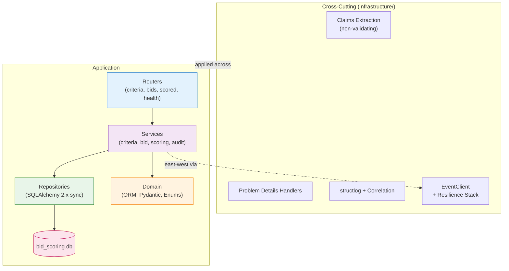
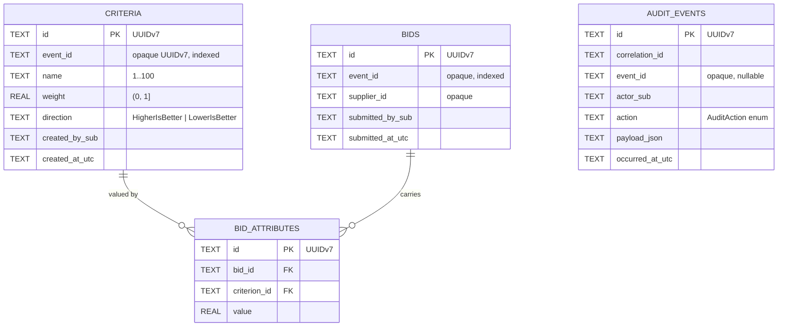
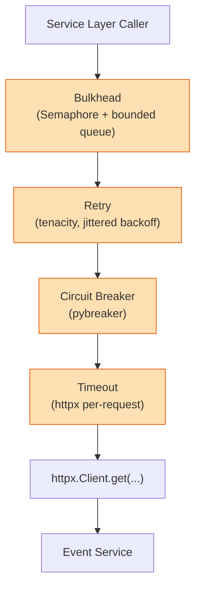
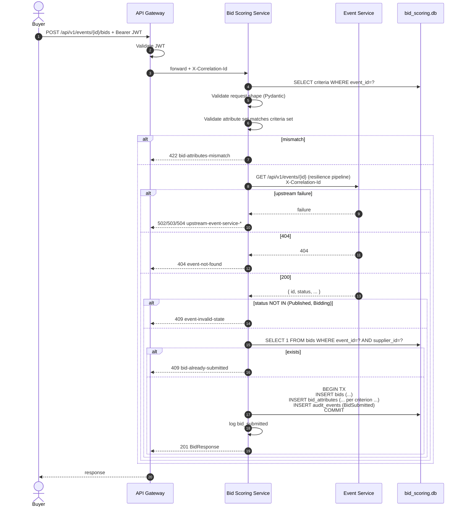
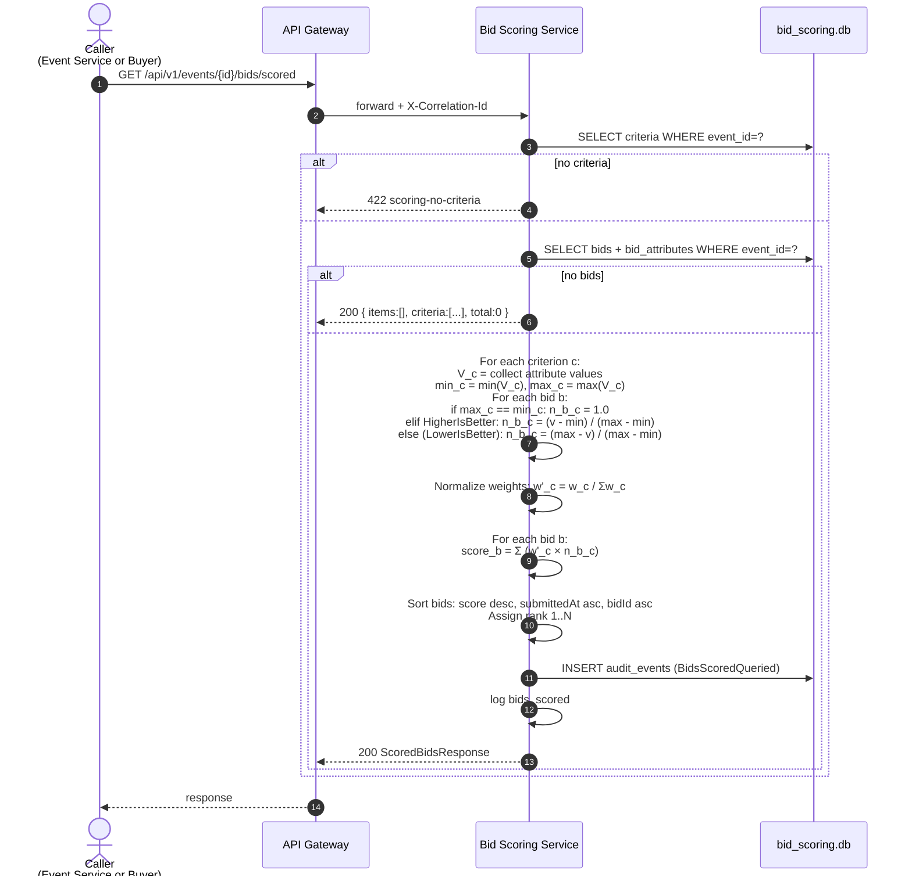

# Low-Level Design (LLD) — Bid Scoring Service

## RFx Sourcing Event Management

---

### Document Control

| Field             | Value                                                                |
| ----------------- | -------------------------------------------------------------------- |
| Document Title    | LLD — Bid Scoring Service                                            |
| Version           | 0.1 (Draft)                                                          |
| Status            | For Development Review                                               |
| Author            | Ramkumar (Solution Architect)                                        |
| Date              | 05 May 2026                                                          |
| Related Artefacts | [BRD.md](BRD.md), [HLD.md](HLD.md), [LLD-event-service.md](LLD-event-service.md), [lld-deliverable-prompt.md](lld-deliverable-prompt.md) |
| Intended Audience | Development Team, Test Team, Technical Leads                         |
| Service           | Bid Scoring Service (Python 3.11 + FastAPI)                          |
| Listening Port    | 5002                                                                 |
| Database          | `bid_scoring.db` (SQLite, file-based)                                |

---

## Table of Contents

1. [Document Purpose & Scope](#1-document-purpose--scope)
2. [Project Structure](#2-project-structure)
3. [Modular Structure](#3-modular-structure)
4. [Database Schema](#4-database-schema)
5. [REST Endpoints — Summary](#5-rest-endpoints--summary)
6. [Request & Response Structures](#6-request--response-structures)
7. [OpenAPI 3.1 Documentation Surface](#7-openapi-31-documentation-surface)
8. [Error Model — RFC 7807 Problem Details](#8-error-model--rfc-7807-problem-details)
9. [Cross-Cutting Concerns](#9-cross-cutting-concerns)
10. [Authentication & Authorisation](#10-authentication--authorisation)
11. [Resilience — Retry / Circuit Breaker / Timeout / Bulkhead](#11-resilience--retry--circuit-breaker--timeout--bulkhead)
12. [Health Endpoint Contract](#12-health-endpoint-contract)
13. [Sequence Diagrams — Core Endpoints](#13-sequence-diagrams--core-endpoints)
14. [External Dependencies / Packages](#14-external-dependencies--packages)
15. [Seed Data Specification](#15-seed-data-specification)
16. [Feature Traceability Matrix](#16-feature-traceability-matrix)
17. [Configuration Reference](#17-configuration-reference)
18. [Open Items / Deferred to Implementation](#18-open-items--deferred-to-implementation)

---

## 1. Document Purpose & Scope

This document is the **Low-Level Design (LLD)** of the Bid Scoring Service, the second of two microservices in the RFx Sourcing capability. It is the build-time reference for developers implementing this service.

**In scope:** project layout, module responsibilities, database schema, REST endpoints, the **scoring algorithm**, request/response shapes, error model, cross-cutting wiring, JWT trust, the resilience pipeline applied to its single east-west call (event-status check), seed dataset, and the configuration surface.

**Out of scope:** source code, build scripts, the API Gateway, the Auth Service, the Event Service (covered in its own LLD).

### 1.1 Service Responsibility

The Bid Scoring Service owns **scoring criteria, bids, and the scoring computation**. It treats `event_id` and `supplier_id` as **opaque UUIDv7 strings**; it never reads the Event Service's database. It calls the Event Service east-west for two specific gates (criteria add and bid submission).

| Owns                                                       | Does Not Own                                              |
| ---------------------------------------------------------- | --------------------------------------------------------- |
| Scoring criteria (per event), bids, bid attributes, ranked-list computation, audit events. | Events, line items, suppliers (master), invitations, awards. |

---

## 2. Project Structure

The Bid Scoring Service is a single FastAPI project. It lives under `services/bid-scoring-service/` in the mono-repo (HLD §12.2).

```
services/bid-scoring-service/
├── pyproject.toml
├── README.md
├── alembic.ini
├── .env.example
├── app/
│   ├── __init__.py
│   ├── main.py                   (FastAPI app construction)
│   ├── routers/
│   │   ├── __init__.py
│   │   ├── criteria.py
│   │   ├── bids.py
│   │   ├── scored.py
│   │   └── health.py
│   ├── services/
│   │   ├── __init__.py
│   │   ├── criteria_service.py
│   │   ├── bid_service.py
│   │   ├── scoring_service.py    (the algorithm)
│   │   ├── audit_service.py
│   │   └── event_client.py       (east-west typed client)
│   ├── repositories/
│   │   ├── __init__.py
│   │   ├── db.py                 (SQLAlchemy engine, session factory)
│   │   ├── criterion_repo.py
│   │   ├── bid_repo.py
│   │   ├── bid_attribute_repo.py
│   │   └── audit_repo.py
│   ├── domain/
│   │   ├── __init__.py
│   │   ├── orm/                  (SQLAlchemy ORM models)
│   │   ├── schemas/              (Pydantic v2 request/response models)
│   │   └── enums.py              (Direction, AuditAction)
│   └── infrastructure/
│       ├── __init__.py
│       ├── settings.py           (pydantic-settings)
│       ├── logging.py            (structlog config)
│       ├── correlation.py        (correlation-id middleware)
│       ├── errors.py             (Problem Details exception handlers)
│       ├── auth.py               (claims extraction; non-validating)
│       └── resilience/
│           ├── __init__.py
│           ├── retry.py          (tenacity policy factory)
│           ├── breaker.py        (pybreaker instance)
│           ├── timeout.py        (httpx timeout config)
│           └── bulkhead.py       (Semaphore wrapper)
├── migrations/                   (Alembic generated)
│   ├── env.py
│   ├── script.py.mako
│   └── versions/
└── tests/
    ├── __init__.py
    ├── conftest.py
    ├── unit/
    └── integration/
```

---

## 3. Modular Structure

The service follows the four-layer architecture defined in HLD §5.3.



### 3.1 Layer Responsibilities

| Layer            | Responsibility                                                                                   | Forbidden                                                          |
| ---------------- | ------------------------------------------------------------------------------------------------ | ------------------------------------------------------------------ |
| Router (FastAPI) | Bind & validate request via Pydantic; delegate to a single Service call; map result/errors.      | DB access, business logic.                                         |
| Service          | Business rules, transaction boundaries, audit emission, east-west invocation, scoring algorithm. | Direct ORM session manipulation, HTTP concerns.                    |
| Repository       | SQLAlchemy session use, query composition, returns ORM objects to Service layer.                 | HTTP, business rules.                                              |
| Domain           | ORM models, Pydantic schemas, enums, invariant guards.                                           | Persistence side-effects, HTTP.                                    |
| Infrastructure   | Settings, logging, error handlers, JWT claims extraction, resilience stack.                      | Business logic.                                                    |

### 3.2 Module Map

| Module           | Owns                                                                | Talks to                                              |
| ---------------- | ------------------------------------------------------------------- | ----------------------------------------------------- |
| Criteria         | Criterion CRUD-lite, weight/direction validation.                  | EventClient (verify event exists & in Draft), Audit.  |
| Bids             | Bid creation (one-shot per supplier), attribute persistence.        | EventClient (verify event in Published/Bidding), Audit. |
| Scoring          | Min-max normalisation, direction-aware inversion, weighted sum, ranking. | Criteria + Bids repositories.                    |
| Audit            | `audit_events` writes, mirrors named log events.                    | All services.                                         |
| EventClient      | Typed httpx client to Event Service, wrapped in resilience stack.   | External Event Service.                               |

---

## 4. Database Schema

### 4.1 ER Diagram



> Note: `event_id` and `supplier_id` are **opaque UUIDv7 strings**. There are **no foreign keys** to Event Service tables (which live in a separate database).

### 4.2 Tables

#### 4.2.1 `criteria`

| Column          | Type    | Constraints                                                  |
| --------------- | ------- | ------------------------------------------------------------ |
| id              | TEXT    | PK, UUIDv7.                                                  |
| event_id        | TEXT    | NOT NULL. Indexed.                                           |
| name            | TEXT    | NOT NULL, length 1–100.                                      |
| weight          | REAL    | NOT NULL, 0 < weight ≤ 1.                                    |
| direction       | TEXT    | NOT NULL, ∈ {`HigherIsBetter`, `LowerIsBetter`}.             |
| created_by_sub  | TEXT    | NOT NULL.                                                    |
| created_at_utc  | TEXT    | NOT NULL.                                                    |

**Indexes:** `idx_criteria_event (event_id)`. Unique on `(event_id, name)` (case-insensitive collation).

#### 4.2.2 `bids`

| Column            | Type | Constraints                                                              |
| ----------------- | ---- | ------------------------------------------------------------------------ |
| id                | TEXT | PK, UUIDv7.                                                              |
| event_id          | TEXT | NOT NULL.                                                                |
| supplier_id       | TEXT | NOT NULL.                                                                |
| submitted_by_sub  | TEXT | NOT NULL.                                                                |
| submitted_at_utc  | TEXT | NOT NULL.                                                                |

**Indexes:** PK; `UNIQUE(event_id, supplier_id)` — enforces D6 (one-shot bids); `idx_bids_event (event_id)`.

#### 4.2.3 `bid_attributes`

| Column        | Type | Constraints                                  |
| ------------- | ---- | -------------------------------------------- |
| id            | TEXT | PK, UUIDv7.                                  |
| bid_id        | TEXT | FK → bids(id), NOT NULL, ON DELETE CASCADE.  |
| criterion_id  | TEXT | FK → criteria(id), NOT NULL, ON DELETE RESTRICT. |
| value         | REAL | NOT NULL.                                    |

**Indexes:** `UNIQUE(bid_id, criterion_id)`; `idx_bid_attr_criterion (criterion_id)`.

**Invariant:** every bid must carry exactly one row in `bid_attributes` for **every** criterion that exists for the bid's event at submission time. Validated at the Service layer; mismatches fail with 422 `bid-attributes-mismatch`.

#### 4.2.4 `audit_events`

Same shape as Event Service's table (LLD-event-service §4.2.6) but resident in this service's database.

| Column          | Type |
| --------------- | ---- |
| id              | TEXT (PK, UUIDv7) |
| correlation_id  | TEXT (NOT NULL) |
| event_id        | TEXT (nullable, opaque) |
| actor_sub       | TEXT (NOT NULL) |
| action          | TEXT — `AuditAction` enum |
| payload_json    | TEXT — JSON snapshot |
| occurred_at_utc | TEXT |

**Indexes:** `idx_audit_event (event_id)`, `idx_audit_occurred (occurred_at_utc)`, `idx_audit_correlation (correlation_id)`.

### 4.3 Enumerations

#### 4.3.1 `Direction`

| Value          | Meaning                                                                  |
| -------------- | ------------------------------------------------------------------------ |
| HigherIsBetter | Higher raw value scores better (e.g., quality rating, capacity).         |
| LowerIsBetter  | Lower raw value scores better (e.g., price, lead time).                  |

#### 4.3.2 `AuditAction`

| Value              | Triggered by                                              |
| ------------------ | --------------------------------------------------------- |
| CriterionAdded     | `POST /events/{id}/criteria`                              |
| CriterionRemoved   | `DELETE /events/{id}/criteria/{criterionId}`              |
| BidSubmitted       | `POST /events/{id}/bids`                                  |
| BidsScoredQueried  | `GET /events/{id}/bids/scored` (informational; written once per call) |

### 4.4 Migrations

Alembic, applied **programmatically on startup** (HLD §10.2). Startup sequence:

1. Construct SQLAlchemy engine pointing at `bid_scoring.db`.
2. Run `alembic upgrade head` programmatically.
3. Run seed loader (§15) — idempotent, gated by `Seed:CheckTable` (defaults to `criteria` — but criteria are not seeded; effectively the seed step is a no-op in this release; see §15).
4. Begin accepting requests.

### 4.5 Scoring Algorithm Specification

This is the **business heart** of the service (FR-07, FR-08). It is specified here in full pseudo-procedure (no source code) so a developer can reproduce it deterministically.

#### 4.5.1 Inputs

- `event_id` (opaque UUIDv7).
- All `criteria` rows for that `event_id`: each has `id`, `name`, `weight ∈ (0, 1]`, `direction`.
- All `bids` rows for that `event_id`. For each bid, all its `bid_attributes`.

#### 4.5.2 Preconditions

| # | Check                                                                                  | On fail        |
| - | -------------------------------------------------------------------------------------- | -------------- |
| 1 | At least one criterion exists for the event.                                           | 422 `scoring-no-criteria` |
| 2 | At least one bid exists for the event.                                                 | 200 with empty `items` (not an error). |
| 3 | Every bid has exactly one attribute per criterion (matched on `criterion_id`).         | 422 `bid-attributes-mismatch` (ideally already prevented at submit time). |

#### 4.5.3 Algorithm

For each criterion `c` with weight `w_c` and direction `d_c`:

1. Collect the set `V_c = { value_b_c : b ∈ bids }` — the per-bid attribute values for criterion `c`.
2. Compute `min_c = min(V_c)`, `max_c = max(V_c)`.
3. For each bid `b`, define normalised value `n_b_c`:
   - If `max_c == min_c` (all equal): `n_b_c = 1.0` (all bids tie on this criterion).
   - Else if `d_c = HigherIsBetter`: `n_b_c = (value_b_c − min_c) / (max_c − min_c)`. Range [0, 1].
   - Else (`d_c = LowerIsBetter`): `n_b_c = (max_c − value_b_c) / (max_c − min_c)`. Range [0, 1].

Normalize the weight vector so it sums to 1:

4. `W = Σ w_c` (over all criteria).
5. For each criterion: `w'_c = w_c / W`.

For each bid `b`, compute the composite score:

6. `score_b = Σ ( w'_c × n_b_c )` over all criteria. Range [0, 1].

Rank bids by `score_b` descending. **Tie-break order:**

7. Higher composite score wins.
8. On exact tie, earlier `submitted_at_utc` wins.
9. On further tie, lower `bid_id` (lexicographic) wins.

#### 4.5.4 Output Shape

A list of `{ rank, bidId, supplierId, score, normalizedScores: { criterionId: n_b_c }, attributes: [...] }` ordered by rank ascending (1, 2, 3, …).

#### 4.5.5 Edge Cases

| Case                                              | Behaviour                                          |
| ------------------------------------------------- | -------------------------------------------------- |
| Single bid                                        | All `n_b_c = 1.0` (degenerate min == max). Score = 1.0. Rank = 1. |
| All bids identical on a criterion (max==min)      | That criterion contributes equally; `n = 1.0` for everyone. |
| Sum of criterion weights ≠ 1                      | Internally renormalised (step 4–5).                |
| Bid missing an attribute for a known criterion    | Should be impossible if §4.2.3 invariant held. If detected at score time, return 422 `bid-attributes-mismatch`. |
| Negative attribute value                          | Allowed; algorithm is sign-agnostic after normalisation. |

---

## 5. REST Endpoints — Summary

All endpoints are mounted under base path `/api/v1`. All require a valid Bearer JWT (validated at the gateway). No endpoint is role-gated in this service.

| # | Method | Path                                                          | Auth   | Purpose                                                  | FR     | Success | Notable Errors           |
| - | ------ | ------------------------------------------------------------- | ------ | -------------------------------------------------------- | ------ | ------- | ------------------------ |
| 1 | POST   | `/api/v1/events/{eventId}/criteria`                           | Any JWT | Add a scoring criterion for the event (Draft only).    | FR-03  | 201     | 404, 409, 422, 502/503/504 |
| 2 | GET    | `/api/v1/events/{eventId}/criteria`                           | Any JWT | List criteria for an event (paginated).                | FR-03  | 200     | 400                       |
| 3 | GET    | `/api/v1/events/{eventId}/criteria/count`                     | Any JWT | Lightweight count (used by Event Service publish gate). | FR-05 | 200    | —                         |
| 4 | DELETE | `/api/v1/events/{eventId}/criteria/{criterionId}`             | Any JWT | Remove a criterion (Draft only).                       | FR-03  | 204     | 404, 409, 502/503/504     |
| 5 | POST   | `/api/v1/events/{eventId}/bids`                               | Any JWT | Submit a bid (Published or Bidding).                   | FR-06  | 201     | 404, 409, 422, 502/503/504 |
| 6 | GET    | `/api/v1/events/{eventId}/bids`                               | Any JWT | List bids for an event (paginated).                    | FR-06  | 200     | 400                       |
| 7 | GET    | `/api/v1/events/{eventId}/bids/{bidId}`                       | Any JWT | Get a single bid with its attributes.                  | FR-06  | 200     | 404                       |
| 8 | GET    | `/api/v1/events/{eventId}/bids/scored`                        | Any JWT | Compute & return ranked bids (used by Event Service Award). | FR-07, FR-08 | 200 | 422                  |
| 9 | GET    | `/health`                                                     | None   | Liveness probe.                                         | —      | 200     | —                         |

**Pagination** (D15): list endpoints accept `?limit=<1..200>&offset=<>=0>`; defaults `limit=50`, `offset=0`. Out-of-range values yield `400`.

---

## 6. Request & Response Structures

### 6.1 Add Criterion — `POST /api/v1/events/{eventId}/criteria`

**Request body**

```json
{
  "name": "UnitPrice",
  "weight": 0.5,
  "direction": "LowerIsBetter"
}
```

| Field     | Type   | Required | Constraints                                                     |
| --------- | ------ | -------- | --------------------------------------------------------------- |
| name      | string | yes      | 1–100 chars; unique per event (case-insensitive).               |
| weight    | number | yes      | `0 < weight ≤ 1`.                                               |
| direction | string | yes      | `HigherIsBetter` or `LowerIsBetter`.                            |

**Pre-conditions checked east-west (D8 mirror):**

1. `GET /api/v1/events/{eventId}` on Event Service returns 200 (event exists).
2. The returned event status is `Draft`.

**Response — 201 Created**

```json
{
  "id": "0190a1b3-c0c0-7d01-9d4f-aa00bb11cc22",
  "eventId": "0190a1b3-c0c0-7a01-9d4f-3e2c1a8b0001",
  "name": "UnitPrice",
  "weight": 0.5,
  "direction": "LowerIsBetter",
  "createdBySub": "buyer-001",
  "createdAtUtc": "2026-05-05T10:25:00Z"
}
```

**Errors**

| Status | Slug                                | When                                                  |
| ------ | ----------------------------------- | ----------------------------------------------------- |
| 404    | event-not-found                     | Event Service returns 404.                            |
| 409    | event-invalid-state                 | Event status is not `Draft`.                          |
| 409    | criterion-name-duplicate            | Name already used for this event.                     |
| 422    | validation-failed                   | Field-level validation failure.                       |
| 502/503/504 | upstream-event-service-*       | East-west failures (see §11.3).                       |

---

### 6.2 List Criteria — `GET /api/v1/events/{eventId}/criteria`

**Query params:** `limit`, `offset` (D15 defaults).

**Response — 200 OK**

```json
{
  "items": [
    {
      "id": "0190a1b3-c0c0-7d01-9d4f-aa00bb11cc22",
      "eventId": "0190a1b3-c0c0-7a01-9d4f-3e2c1a8b0001",
      "name": "UnitPrice",
      "weight": 0.5,
      "direction": "LowerIsBetter",
      "createdAtUtc": "2026-05-05T10:25:00Z"
    }
  ],
  "limit": 50,
  "offset": 0,
  "total": 1
}
```

This endpoint **does not** require an east-west call — it's a pure local read.

---

### 6.3 Criteria Count — `GET /api/v1/events/{eventId}/criteria/count`

Lightweight endpoint specifically for the Event Service publish gate (D8 / LLD-event-service §6.10).

**Response — 200 OK**

```json
{
  "eventId": "0190a1b3-c0c0-7a01-9d4f-3e2c1a8b0001",
  "count": 3
}
```

No east-west; pure local count. Always returns 200 — `count` of 0 is a valid result.

---

### 6.4 Remove Criterion — `DELETE /api/v1/events/{eventId}/criteria/{criterionId}`

**Pre-conditions:** event exists in Event Service AND status is `Draft` (east-west check). No bids may yet reference this criterion (enforced by `bid_attributes` FK + `RESTRICT`).

**Response — 204 No Content.**

**Errors:** 404, 409 `event-invalid-state`, 409 `criterion-in-use` (if any bid_attributes reference it), 502/503/504.

---

### 6.5 Submit Bid — `POST /api/v1/events/{eventId}/bids`

**Request body**

```json
{
  "supplierId": "0190a1b3-c0c0-7b01-9d4f-aa11bb22cc01",
  "attributes": [
    { "criterionId": "0190a1b3-c0c0-7d01-9d4f-aa00bb11cc22", "value": 1250.50 },
    { "criterionId": "0190a1b3-c0c0-7d02-9d4f-aa00bb11cc23", "value": 14 },
    { "criterionId": "0190a1b3-c0c0-7d03-9d4f-aa00bb11cc24", "value": 88 }
  ]
}
```

| Field                      | Type   | Required | Constraints                                                       |
| -------------------------- | ------ | -------- | ----------------------------------------------------------------- |
| supplierId                 | string | yes      | UUIDv7 (treated opaquely).                                        |
| attributes                 | array  | yes      | Length must equal the number of criteria for this event.          |
| attributes[].criterionId   | string | yes      | UUIDv7 of an existing criterion for this event.                   |
| attributes[].value         | number | yes      | Any real number; sign meaning is per criterion direction.        |

**Pre-conditions checked east-west (D9):**

1. `GET /api/v1/events/{eventId}` on Event Service returns 200.
2. The returned event status is `Published` or `Bidding`.

**Local invariants:**

3. No existing bid for `(eventId, supplierId)` — UNIQUE constraint enforces D6.
4. Submitted `attributes` set covers exactly the set of criterion IDs known for this event (no missing, no extra, no duplicates).

**Response — 201 Created**

```json
{
  "id": "0190a1b3-c0c0-7e01-9d4f-bb22cc33dd44",
  "eventId": "0190a1b3-c0c0-7a01-9d4f-3e2c1a8b0001",
  "supplierId": "0190a1b3-c0c0-7b01-9d4f-aa11bb22cc01",
  "submittedBySub": "buyer-001",
  "submittedAtUtc": "2026-05-05T11:05:42Z",
  "attributes": [
    { "criterionId": "0190a1b3-c0c0-7d01-9d4f-aa00bb11cc22", "value": 1250.50 },
    { "criterionId": "0190a1b3-c0c0-7d02-9d4f-aa00bb11cc23", "value": 14 },
    { "criterionId": "0190a1b3-c0c0-7d03-9d4f-aa00bb11cc24", "value": 88 }
  ]
}
```

**Errors**

| Status | Slug                            | When                                                  |
| ------ | ------------------------------- | ----------------------------------------------------- |
| 404    | event-not-found                 | Event Service returns 404.                            |
| 409    | event-invalid-state             | Event status not `Published`/`Bidding`.               |
| 409    | bid-already-submitted           | Supplier already has a bid for this event (UNIQUE violation). |
| 422    | bid-attributes-mismatch         | Attributes don't match criteria set.                  |
| 422    | validation-failed               | Other validation.                                     |
| 502/503/504 | upstream-event-service-*    | East-west failures.                                   |

---

### 6.6 List Bids — `GET /api/v1/events/{eventId}/bids`

**Response — 200 OK**

```json
{
  "items": [
    {
      "id": "0190a1b3-c0c0-7e01-9d4f-bb22cc33dd44",
      "eventId": "0190a1b3-c0c0-7a01-9d4f-3e2c1a8b0001",
      "supplierId": "0190a1b3-c0c0-7b01-9d4f-aa11bb22cc01",
      "submittedAtUtc": "2026-05-05T11:05:42Z"
    }
  ],
  "limit": 50,
  "offset": 0,
  "total": 1
}
```

Attribute payload is **not** included in the list view; use §6.7 for the full bid.

---

### 6.7 Get Bid — `GET /api/v1/events/{eventId}/bids/{bidId}`

**Response — 200 OK** — same shape as the §6.5 response (full attributes inline).

---

### 6.8 Scored Bids — `GET /api/v1/events/{eventId}/bids/scored`

The **score-and-rank** endpoint. Used by Event Service during Award.

**Query params:** `limit` (default 50, max 200) — applied **after** ranking. `offset` (default 0).

**Response — 200 OK**

```json
{
  "eventId": "0190a1b3-c0c0-7a01-9d4f-3e2c1a8b0001",
  "computedAtUtc": "2026-05-05T11:40:00Z",
  "criteria": [
    { "criterionId": "0190a1b3-c0c0-7d01-9d4f-aa00bb11cc22", "name": "UnitPrice", "weight": 0.5, "normalizedWeight": 0.5, "direction": "LowerIsBetter" },
    { "criterionId": "0190a1b3-c0c0-7d02-9d4f-aa00bb11cc23", "name": "LeadTimeDays", "weight": 0.3, "normalizedWeight": 0.3, "direction": "LowerIsBetter" },
    { "criterionId": "0190a1b3-c0c0-7d03-9d4f-aa00bb11cc24", "name": "QualityScore", "weight": 0.2, "normalizedWeight": 0.2, "direction": "HigherIsBetter" }
  ],
  "items": [
    {
      "rank": 1,
      "bidId": "0190a1b3-c0c0-7e02-9d4f-bb22cc33dd55",
      "supplierId": "0190a1b3-c0c0-7b02-9d4f-aa11bb22cc02",
      "score": 0.91,
      "normalizedScores": {
        "0190a1b3-c0c0-7d01-9d4f-aa00bb11cc22": 1.0,
        "0190a1b3-c0c0-7d02-9d4f-aa00bb11cc23": 0.85,
        "0190a1b3-c0c0-7d03-9d4f-aa00bb11cc24": 0.92
      }
    },
    {
      "rank": 2,
      "bidId": "0190a1b3-c0c0-7e01-9d4f-bb22cc33dd44",
      "supplierId": "0190a1b3-c0c0-7b01-9d4f-aa11bb22cc01",
      "score": 0.62,
      "normalizedScores": {
        "0190a1b3-c0c0-7d01-9d4f-aa00bb11cc22": 0.55,
        "0190a1b3-c0c0-7d02-9d4f-aa00bb11cc23": 0.40,
        "0190a1b3-c0c0-7d03-9d4f-aa00bb11cc24": 1.0
      }
    }
  ],
  "limit": 50,
  "offset": 0,
  "total": 2
}
```

| Field                | Type    | Description                                                |
| -------------------- | ------- | ---------------------------------------------------------- |
| computedAtUtc        | string  | When the ranked list was computed (this request).          |
| criteria[]           | array   | Snapshot of criteria used in this computation.             |
| items[].rank         | int     | 1-based rank (1 = best).                                   |
| items[].score        | number  | Composite normalised score, range [0, 1].                  |
| items[].normalizedScores | object | Per-criterion normalised value, keyed by `criterionId`. |

**Errors**

| Status | Slug                       | When                                |
| ------ | -------------------------- | ----------------------------------- |
| 422    | scoring-no-criteria        | No criteria defined for this event. |
| 422    | bid-attributes-mismatch    | Data integrity issue at score time. |

This endpoint **does not** call Event Service east-west — it operates purely on local data.

---

### 6.9 Health — `GET /health`

```json
{ "status": "ok" }
```

See §12.

---

## 7. OpenAPI 3.1 Documentation Surface

FastAPI auto-emits OpenAPI 3.1 at `/openapi.json` and Swagger UI at `/docs`. The hand-authored `contracts/bid-scoring-service/v1/openapi.yaml` (HLD §8.2) is the source of truth and is reconciled against the runtime emission.

### 7.1 Document Skeleton

| Section            | Content                                       |
| ------------------ | --------------------------------------------- |
| `openapi`          | `3.1.0`                                       |
| `info.title`       | `Bid Scoring Service API`                     |
| `info.version`     | `1.0.0`                                       |
| `info.description` | "RFx scoring criteria, bids, and ranked-bid computation." |
| `servers[0].url`   | `http://localhost:5000` (gateway) and `http://localhost:5002` (direct, dev only) |
| `security`         | default `bearerAuth: []`                      |
| `tags`             | Criteria, Bids, Scoring, Health.              |

### 7.2 Path Catalogue

| operationId         | Method | Path                                                 |
| ------------------- | ------ | ---------------------------------------------------- |
| addCriterion        | POST   | /api/v1/events/{eventId}/criteria                    |
| listCriteria        | GET    | /api/v1/events/{eventId}/criteria                    |
| getCriteriaCount    | GET    | /api/v1/events/{eventId}/criteria/count              |
| removeCriterion     | DELETE | /api/v1/events/{eventId}/criteria/{criterionId}      |
| submitBid           | POST   | /api/v1/events/{eventId}/bids                        |
| listBids            | GET    | /api/v1/events/{eventId}/bids                        |
| getBid              | GET    | /api/v1/events/{eventId}/bids/{bidId}                |
| getScoredBids       | GET    | /api/v1/events/{eventId}/bids/scored                 |
| getHealth           | GET    | /health                                              |

### 7.3 Component Schema Catalogue

| Schema name              | Used in                                  |
| ------------------------ | ---------------------------------------- |
| CriterionCreateRequest   | addCriterion request body.               |
| CriterionResponse        | addCriterion / listCriteria item.        |
| CriterionListResponse    | listCriteria envelope.                   |
| CriteriaCountResponse    | getCriteriaCount response.               |
| BidAttribute             | Element of bid attributes array.         |
| BidCreateRequest         | submitBid request body.                  |
| BidResponse              | submitBid / getBid response.             |
| BidSummary               | listBids `items[]`.                      |
| BidListResponse          | listBids envelope.                       |
| ScoredBidItem            | getScoredBids `items[]`.                 |
| ScoredCriterionInfo      | getScoredBids `criteria[]`.              |
| ScoredBidsResponse       | getScoredBids response envelope.         |
| HealthResponse           | getHealth response.                      |
| ProblemDetails           | All 4xx/5xx responses (RFC 7807, see §8). |
| PaginationEnvelope       | Common shape for list responses.         |

### 7.4 Security Schemes

```
components.securitySchemes:
  bearerAuth:
    type: http
    scheme: bearer
    bearerFormat: JWT
```

### 7.5 Tags

| Tag      | Description                              |
| -------- | ---------------------------------------- |
| Criteria | Scoring criteria CRUD-lite.              |
| Bids     | Bid submission and retrieval.            |
| Scoring  | Ranked-bid computation.                  |
| Health   | Liveness probe.                          |

---

## 8. Error Model — RFC 7807 Problem Details

Identical body shape to LLD-event-service §8 (the two services share a slug taxonomy). Repeated here for the developer's convenience.

### 8.1 Common Body Shape

```json
{
  "type": "https://rfx-sourcing/problems/bid-attributes-mismatch",
  "title": "Bid attributes do not match the event's criteria set",
  "status": 422,
  "detail": "Submitted attributes (3) do not cover criteria set (4). Missing: ['LeadTimeDays'].",
  "instance": "/api/v1/events/0190a1b3-c0c0-7a01-9d4f-3e2c1a8b0001/bids",
  "correlationId": "1f2e3d4c-5b6a-7980-1122-334455667788",
  "errors": [
    { "field": "attributes", "message": "Missing criterion 'LeadTimeDays'." }
  ]
}
```

Field semantics: same as LLD-event-service §8.1.

### 8.2 HTTP Status Mapping

| Status | Trigger                                                      |
| ------ | ------------------------------------------------------------ |
| 400    | Malformed request, bad query params.                         |
| 401    | Gateway-only; not enforced here (HLD §9.2).                  |
| 403    | Not used in this service.                                    |
| 404    | Resource not found (criterion, bid, or upstream event).      |
| 409    | State / uniqueness violation.                                |
| 422    | Semantic validation (attributes mismatch, scoring preconditions). |
| 500    | Unhandled error.                                             |
| 502    | Event Service returned 5xx after retries.                    |
| 503    | Circuit breaker open or bulkhead rejected.                   |
| 504    | Per-attempt timeout exceeded.                                |

### 8.3 Slug Catalogue (Bid Scoring Service)

| Slug                                 | Status  | Surface                                              |
| ------------------------------------ | ------- | ---------------------------------------------------- |
| validation-failed                    | 400/422 | Generic field validation envelope.                   |
| event-not-found                      | 404     | Event Service returned 404 on east-west call.        |
| criterion-not-found                  | 404     | Local lookup miss.                                   |
| bid-not-found                        | 404     | Local lookup miss.                                   |
| event-invalid-state                  | 409     | Event status incompatible with the operation.        |
| criterion-name-duplicate             | 409     | Duplicate criterion name for the same event.         |
| criterion-in-use                     | 409     | Cannot delete a criterion already referenced by a bid. |
| bid-already-submitted                | 409     | Supplier has already bid on this event (D6).         |
| bid-attributes-mismatch              | 422     | Attribute set ≠ criteria set.                        |
| scoring-no-criteria                  | 422     | `GET /bids/scored` with zero criteria.               |
| upstream-event-service-failed        | 502     | ES 5xx after retries.                                |
| upstream-event-service-unavailable   | 503     | Circuit breaker open.                                |
| upstream-event-service-timeout       | 504     | Per-attempt timeout exceeded.                        |
| internal-error                       | 500     | Catch-all.                                           |

### 8.4 Exception → Status Mapping (registered as FastAPI exception handlers)

| Python exception (custom)        | Maps to | Slug                              |
| -------------------------------- | ------- | --------------------------------- |
| `ValidationError` (Pydantic) / `RequestValidationError` (FastAPI) | 422 | validation-failed |
| `NotFoundError` (custom)         | 404     | resource-specific (per type)      |
| `ConflictError` (custom)         | 409     | per discriminator                 |
| `UnprocessableError` (custom)    | 422     | per discriminator                 |
| `UpstreamFailureError` (custom)  | 502/503/504 | upstream-event-service-*      |
| `Exception` (fallback)           | 500     | internal-error                    |

A single root exception handler maps these to Problem Details responses with `Content-Type: application/problem+json`.

---

## 9. Cross-Cutting Concerns

### 9.1 Structured Logging (structlog)

- Renderer: `structlog.processors.JSONRenderer()` to stdout.
- Processors chain: timestamp (UTC ISO-8601), log level, correlation enrichment, service name (`bid-scoring-service`), version, exception info.
- Levels: `INFO` (default), `DEBUG` in dev.

#### 9.1.1 Named Lifecycle Log Events

| Event name             | Level | Properties                                                              |
| ---------------------- | ----- | ----------------------------------------------------------------------- |
| `criterion_added`      | INFO  | eventId, criterionId, name, weight, direction                           |
| `criterion_removed`    | INFO  | eventId, criterionId                                                    |
| `bid_submitted`        | INFO  | eventId, bidId, supplierId, attributeCount                              |
| `bids_scored`          | INFO  | eventId, criteriaCount, bidCount, computedAtUtc                         |
| `upstream_call`        | DEBUG | target=event-service, operation, durationMs, statusCode, attempt       |
| `upstream_failure`     | WARN  | target, operation, statusCode/exceptionType, attempt                    |
| `unhandled_error`      | ERROR | exceptionType, message, stack                                           |

### 9.2 Correlation IDs

- ASGI middleware reads `X-Correlation-Id` from inbound request; if absent, generates a UUIDv4.
- Bound to `structlog.contextvars` for the request lifetime.
- Propagated outbound on every east-west call to Event Service.
- Captured in: every log entry, every `audit_events` row, every Problem Details body.

### 9.3 Configuration (`pydantic-settings`)

Sources, in precedence: environment variables > `.env` file > defaults declared on the `Settings` class.

Typed settings groups:

| Class            | Prefix / source            |
| ---------------- | -------------------------- |
| `JwtSettings`    | env `JWT_*`                |
| `EventClientSettings` | env `EVENT_CLIENT_*`  |
| `ResilienceSettings`  | env `RESILIENCE_*`    |
| `SeedSettings`   | env `SEED_*`               |
| `LoggingSettings` | env `LOG_*`               |
| `DatabaseSettings` | env `DB_*`               |

See §17.

### 9.4 Validation (Pydantic v2)

- Request bodies bind to Pydantic v2 models in `app/domain/schemas/`.
- FastAPI returns 422 by default; the global handler reshapes it to Problem Details with slug `validation-failed`.
- Custom semantic validators (e.g., `attributes` set match) live in the Service layer and raise `UnprocessableError`.

### 9.5 Audit Persistence

Identical contract to the Event Service: audit rows are written **inside the same transaction** as the business mutation. Service layer responsibility; Routers do not write audit.

### 9.6 Serialization Conventions

- JSON property naming: `camelCase` (Pydantic `populate_by_name = True` + alias generators).
- Nulls omitted (`model_dump(exclude_none=True)` for outbound).
- Enums serialised as their string value.
- DateTimes: ISO-8601 UTC with `Z` suffix.

---

## 10. Authentication & Authorisation

### 10.1 Trust Model

Per HLD §9.2, JWT validation occurs **only at the API Gateway**. The Bid Scoring Service trusts the request when reached through the gateway. When reached on its direct port (5002) for development, the service does not enforce the JWT — this is the documented R1 risk in HLD §18.

### 10.2 Claims Read (without re-validation)

| Claim   | Read for                                                  |
| ------- | --------------------------------------------------------- |
| `sub`   | `created_by_sub`, `submitted_by_sub`, audit `actor_sub`. |
| `roles` | Not required for any endpoint in this service.            |

If `sub` is missing on a successful gateway-passed request, the service returns 500 `internal-error`.

### 10.3 Role Gates

**None** in this service (D13). All endpoints are authenticated-only at the gateway level.

### 10.4 Token Algorithm & Secret

- Algorithm: **HS256**.
- The signing key is configured via `JWT_SIGNING_KEY` for parity with Event Service, but is **not used at runtime here** since JWT is validated at the gateway. It is reserved for the optional Phase-2 defence-in-depth (HLD §18 R1 mitigation).

---

## 11. Resilience — Retry / Circuit Breaker / Timeout / Bulkhead

The Bid Scoring Service initiates **east-west calls to the Event Service** in three places:

1. `EventClient.get_event(event_id)` — used by Add Criterion (verify Draft).
2. `EventClient.get_event(event_id)` — used by Submit Bid (verify Published/Bidding).
3. `EventClient.get_event(event_id)` — used by Remove Criterion (verify Draft).

All three resolve to a single typed operation. Resilience is applied uniformly.

### 11.1 Pipeline Composition

The same composition order as the Event Service (LLD-event-service §11.1). Order outermost → innermost:



### 11.2 Component-by-Component Specification

#### 11.2.1 Bulkhead

- Implementation: a module-level `threading.Semaphore` with `value = MaxConcurrent`. A bounded queue is realised by acquiring with a non-blocking `try-acquire` followed by a bounded blocking acquire with a short timeout.
- Reject path: `BulkheadRejectedError` → mapped to 503 `upstream-event-service-unavailable`.
- Default: `MaxConcurrent = 10`, `MaxQueued = 20`. Approximation: when ≥ 30 calls are simultaneously inflight, the 31st is rejected.

#### 11.2.2 Retry (tenacity)

- Strategy: `retry_if_exception_type((httpx.HTTPError, ServerError5xx))` AND `retry_if_result(is_retryable_status)`.
- `stop`: `stop_after_attempt(retry_count + 1)`. Default `retry_count = 3` ⇒ up to 4 attempts.
- `wait`: `wait_exponential_jitter(initial=0.2 s, max=2 s)`.
- Retryable statuses: `408, 429, 500, 502, 503, 504`.
- After retry exhaustion: `RetryError` raised → bubbles to handler → 502 `upstream-event-service-failed`.

#### 11.2.3 Circuit Breaker (pybreaker)

- One module-level `CircuitBreaker(fail_max=…, reset_timeout=…)` instance per downstream service.
- Open conditions: failure ratio ≥ `0.5` over `30 s` sampling window with at least `10` calls.
- After break: open for `10 s`, then half-open (single trial probe).
- Open path: `CircuitBreakerError` → mapped to 503 `upstream-event-service-unavailable`.

> **Note on pybreaker semantics:** pybreaker's native model is "fail_max consecutive failures". The 50%/30s/min-throughput semantics are achieved by wrapping the breaker with a sliding-window counter (custom `BreakerListener`) that triggers `breaker.open()` when conditions are met. The LLD prescribes the desired behaviour; the implementation chooses between (a) custom listener + native pybreaker, or (b) substituting `purgatory`/equivalent that natively supports failure-ratio breakers. Either is acceptable.

#### 11.2.4 Timeout (httpx)

- Per-attempt timeout: `httpx.Timeout(timeout=PerAttemptSec, connect=2.0, read=PerAttemptSec, write=PerAttemptSec, pool=PerAttemptSec)`.
- Default `PerAttemptSec = 5`.
- Timeout path: `httpx.TimeoutException` → 504 `upstream-event-service-timeout`.

### 11.3 Defaults (configurable per D12)

Identical to the Event Service. Bound to settings via `pydantic-settings`. See §17.3.

| Pattern                     | Default                                           |
| --------------------------- | ------------------------------------------------- |
| Per-attempt timeout         | 5 s                                               |
| Retry — count               | 3                                                 |
| Retry — backoff             | Exponential, base 200 ms, max 2 s, with jitter   |
| Retryable statuses          | 408, 429, 500, 502, 503, 504                      |
| CB — failure ratio          | 0.5 over 30 s                                     |
| CB — minimum throughput     | 10                                                |
| CB — break duration         | 10 s                                              |
| Bulkhead — max concurrent   | 10                                                |
| Bulkhead — max queued       | 20                                                |

### 11.4 Failure Surface

| Outcome                                   | Returned as                                   |
| ----------------------------------------- | --------------------------------------------- |
| `CircuitBreakerError`                     | 503 `upstream-event-service-unavailable`      |
| `TimeoutException`                        | 504 `upstream-event-service-timeout`          |
| `BulkheadRejectedError`                   | 503 `upstream-event-service-unavailable`      |
| `RetryError` after final 5xx              | 502 `upstream-event-service-failed`           |
| Final attempt non-retryable 4xx           | 502 `upstream-event-service-failed` (with original status in `detail`) |
| 404 on event lookup                       | 404 `event-not-found` (passed through; not an upstream failure) |

### 11.5 Logging Hooks

- Each retry attempt logs `upstream_call` at DEBUG with `attempt` ≥ 2.
- Retry exhaustion / breaker open / timeout / bulkhead reject logs `upstream_failure` at WARN.

### 11.6 Event Client Surface

Single typed operation; resilience uniform across all callers.

| Operation     | Verb + Path on ES                          | Returns                                          |
| ------------- | ------------------------------------------ | ------------------------------------------------ |
| get_event     | `GET /api/v1/events/{eventId}`             | `EventResponse` (LLD-event-service §6.3)         |

`X-Correlation-Id` is forwarded on every call. The client only cares about `id` and `status` from the response.

---

## 12. Health Endpoint Contract

Per D14, basic liveness only.

| Field              | Value                              |
| ------------------ | ---------------------------------- |
| Method             | `GET`                              |
| Path               | `/health`                          |
| Authentication     | None.                              |
| Status code (live) | 200 OK.                            |
| Response body      | `{"status":"ok"}`                  |
| Side effects       | None. Does not touch DB or ES.    |
| Cache headers      | `Cache-Control: no-store`.         |

If the process is shutting down: 503 `{"status":"shutting-down"}`. Liveness/readiness split deferred (HLD §11.5).

---

## 13. Sequence Diagrams — Core Endpoints

### 13.1 Submit Bid (east-west event-status check)



### 13.2 Score Bids (internal compute)



---

## 14. External Dependencies / Packages

### 14.1 Runtime Packages (`pyproject.toml`)

| Package               | Version  | Purpose                                          |
| --------------------- | -------- | ------------------------------------------------ |
| fastapi               | ^0.115   | Web framework + OpenAPI emission.                |
| uvicorn               | ^0.32    | ASGI server.                                     |
| pydantic              | ^2.7     | Request/response validation, ORM-like models.    |
| pydantic-settings     | ^2.5     | Settings binding from env / `.env`.              |
| sqlalchemy            | ^2.0     | ORM (sync mode per HLD §3.2).                    |
| alembic               | ^1.13    | Migrations.                                      |
| structlog             | ^24.1    | Structured logging.                              |
| httpx                 | ^0.27    | East-west sync HTTP client.                      |
| tenacity              | ^9.0     | Retry policy.                                    |
| pybreaker             | ^1.2     | Circuit breaker.                                 |
| python-jose[cryptography] *or* pyjwt | latest | HS256 verification (reserved for Phase 2). |
| uuid7                 | latest   | UUIDv7 generation (or stdlib `uuid` if available). |
| python-dotenv         | ^1.0     | `.env` loading (transitive via pydantic-settings). |

### 14.2 Test Packages

| Package              | Version  | Purpose                                |
| -------------------- | -------- | -------------------------------------- |
| pytest               | ^8.3     | Test framework.                        |
| pytest-mock          | ^3.14    | Mocking.                               |
| pytest-asyncio       | ^0.24    | Async tests (limited use; sync-first). |
| httpx                | ^0.27    | Doubles as `TestClient` transport.     |
| respx                | ^0.21    | Mocking httpx for east-west tests.     |

---

## 15. Seed Data Specification

Per HLD §10.3, seed runs on startup, hardcoded, idempotent.

### 15.1 Seeding Switch

| Configuration key | Default | Notes                                                   |
| ----------------- | ------- | ------------------------------------------------------- |
| `SEED_ENABLED`    | `true`  | Master switch.                                          |
| `SEED_CHECK_TABLE` | `criteria` | Idempotency check table.                            |

### 15.2 What Is Seeded

**Nothing is seeded by default in this service.** Criteria are inherently per-event and depend on events that are created live during demos. Seeding speculative criteria/bids would couple the seed to specific Event Service UUIDs, which is brittle.

A `SEED_DEMO_DATASET=true` flag is reserved for a future release that pre-creates a coordinated cross-service demo dataset (Event Service + Bid Scoring Service together) — out of scope for this LLD.

### 15.3 Audit Seed

**No seed audit rows.** Audit accrues organically during live demos.

---

## 16. Feature Traceability Matrix

| FR    | Requirement                                           | Endpoint(s) (this LLD)                              | Tables                | Audit action     |
| ----- | ----------------------------------------------------- | --------------------------------------------------- | --------------------- | ---------------- |
| FR-01 | Create RFx event                                      | *(Event Service)*                                  | —                     | —                |
| FR-02 | Add line items                                        | *(Event Service)*                                  | —                     | —                |
| FR-03 | Define scoring criteria with weights                  | POST/GET/DELETE /events/{id}/criteria               | criteria              | CriterionAdded/Removed |
| FR-04 | Add suppliers to invitation list                      | *(Event Service)*                                  | —                     | —                |
| FR-05 | Publish event (Draft → Published)                     | GET /events/{id}/criteria/count (consumed by ES)   | criteria              | —                |
| FR-06 | Accept bids for a published event                     | POST /events/{id}/bids                              | bids, bid_attributes  | BidSubmitted     |
| FR-07 | Score submitted bids against criteria                 | GET /events/{id}/bids/scored (algorithm §4.5)       | criteria, bids, bid_attributes | BidsScoredQueried |
| FR-08 | Produce ranked list of bids                           | GET /events/{id}/bids/scored                        | (same)                | (same)           |
| FR-09 | Award event to chosen supplier                        | *(Event Service consumes scored bids)*             | —                     | —                |
| FR-10 | View event status and details                         | GET /events/{id}/bids, GET /events/{id}/criteria    | criteria, bids        | —                |
| FR-11 | Authenticated access                                  | All endpoints (Auth at gateway)                     | —                     | —                |
| FR-12 | Audit trail for key actions                           | All mutating endpoints write `audit_events` + named logs | audit_events     | (every action above) |

---

## 17. Configuration Reference

All values are loaded by `pydantic-settings` from environment variables (or `.env` in development).

### 17.1 JWT

| Key                | Type   | Default        | Notes                                       |
| ------------------ | ------ | -------------- | ------------------------------------------- |
| `JWT_ISSUER`       | string | `rfx-auth`     | Reserved for Phase-2 defence-in-depth.      |
| `JWT_AUDIENCE`     | string | `rfx-sourcing` | Reserved.                                   |
| `JWT_SIGNING_KEY`  | string | *(unused at runtime in this service)* | Reserved (see §10.4). |
| `JWT_CLOCK_SKEW_SEC` | int  | `30`           | Reserved.                                   |

### 17.2 Event Client (east-west to Event Service)

| Key                    | Type   | Default                  |
| ---------------------- | ------ | ------------------------ |
| `EVENT_CLIENT_BASE_URL` | string | `http://localhost:5001` |
| `EVENT_CLIENT_USER_AGENT` | string | `bid-scoring-service/1.0` |

### 17.3 Resilience

| Key                                          | Type    | Default | Range / Notes                  |
| -------------------------------------------- | ------- | ------- | ------------------------------ |
| `RESILIENCE_TIMEOUT_PER_ATTEMPT_SEC`         | float   | 5.0     | 0.25 – 60.0                    |
| `RESILIENCE_RETRY_COUNT`                     | int     | 3       | 0 – 10                         |
| `RESILIENCE_RETRY_BACKOFF_BASE_MS`           | int     | 200     | 50 – 5000                      |
| `RESILIENCE_RETRY_MAX_BACKOFF_MS`            | int     | 2000    | 200 – 30000                    |
| `RESILIENCE_RETRY_JITTER_ENABLED`            | bool    | true    |                                |
| `RESILIENCE_RETRY_RETRYABLE_STATUSES`        | csv ints | `408,429,500,502,503,504` |                  |
| `RESILIENCE_BREAKER_FAILURE_RATIO`           | float   | 0.5     | 0.1 – 1.0                      |
| `RESILIENCE_BREAKER_SAMPLING_WINDOW_SEC`     | int     | 30      | 5 – 600                        |
| `RESILIENCE_BREAKER_MINIMUM_THROUGHPUT`      | int     | 10      | 1 – 1000                       |
| `RESILIENCE_BREAKER_BREAK_DURATION_SEC`      | int     | 10      | 1 – 600                        |
| `RESILIENCE_BULKHEAD_MAX_CONCURRENT`         | int     | 10      | 1 – 1000                       |
| `RESILIENCE_BULKHEAD_MAX_QUEUED`             | int     | 20      | 0 – 10000                      |

### 17.4 Seed

| Key                | Type   | Default     | Notes                                    |
| ------------------ | ------ | ----------- | ---------------------------------------- |
| `SEED_ENABLED`     | bool   | true        | Master switch.                           |
| `SEED_CHECK_TABLE` | string | `criteria`  | Idempotency check table.                 |

### 17.5 Database

| Key                             | Type   | Default                          |
| ------------------------------- | ------ | -------------------------------- |
| `DB_URL`                        | string | `sqlite:///./bid_scoring.db`     |
| `DB_APPLY_MIGRATIONS_ON_STARTUP`| bool   | true                             |

### 17.6 Logging

| Key                | Type   | Default       | Notes                       |
| ------------------ | ------ | ------------- | --------------------------- |
| `LOG_LEVEL`        | string | `INFO`        | One of DEBUG/INFO/WARN/ERROR. |
| `LOG_RENDERER`     | string | `json`        | `json` or `console` (dev).  |

---

## 18. Open Items / Deferred to Implementation

These items are intentionally not specified in this LLD; they will be resolved during implementation or in a follow-up document:

1. Concrete Alembic revision IDs and the exact column types beyond what is required.
2. Specific `structlog` event-name strings beyond the named lifecycle events.
3. The exact pybreaker-vs-purgatory choice for failure-ratio breaker semantics (§11.2.3).
4. Cross-service coordinated seed dataset for live demo (§15.2).
5. Postman collection contents (HLD §13.5).
6. Distributed tracing (HLD §15 evolution path).
7. Consumer-driven contract testing with the Event Service (Pact deferred per HLD §15).
8. Performance tuning of the scoring algorithm beyond demo scale (BRD A10).

---

### Document History

| Version | Date        | Author    | Notes                                  |
| ------- | ----------- | --------- | -------------------------------------- |
| 0.1     | 05 May 2026 | Ramkumar  | Initial draft for development review.  |

---

*End of Document*
