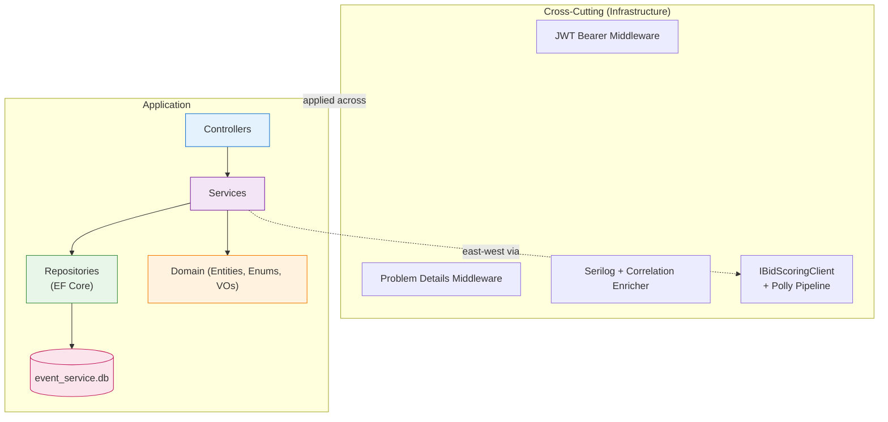
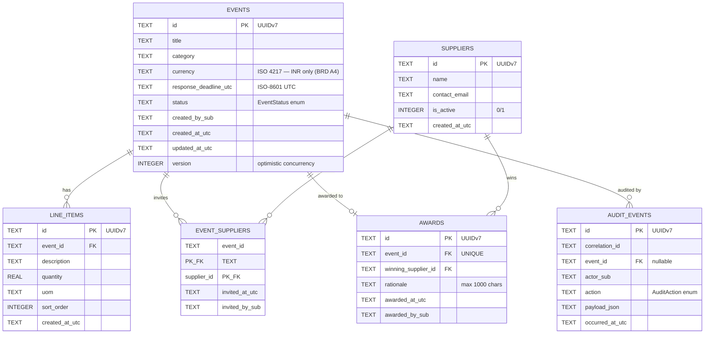
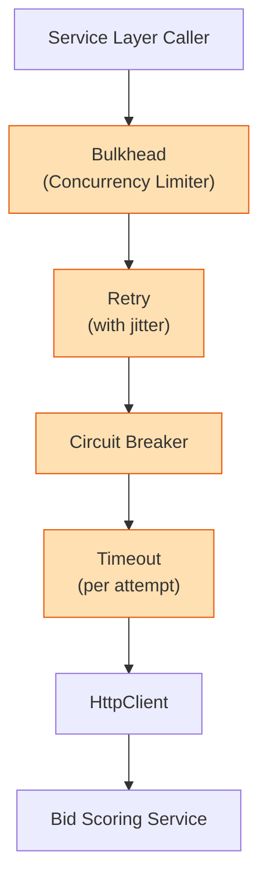
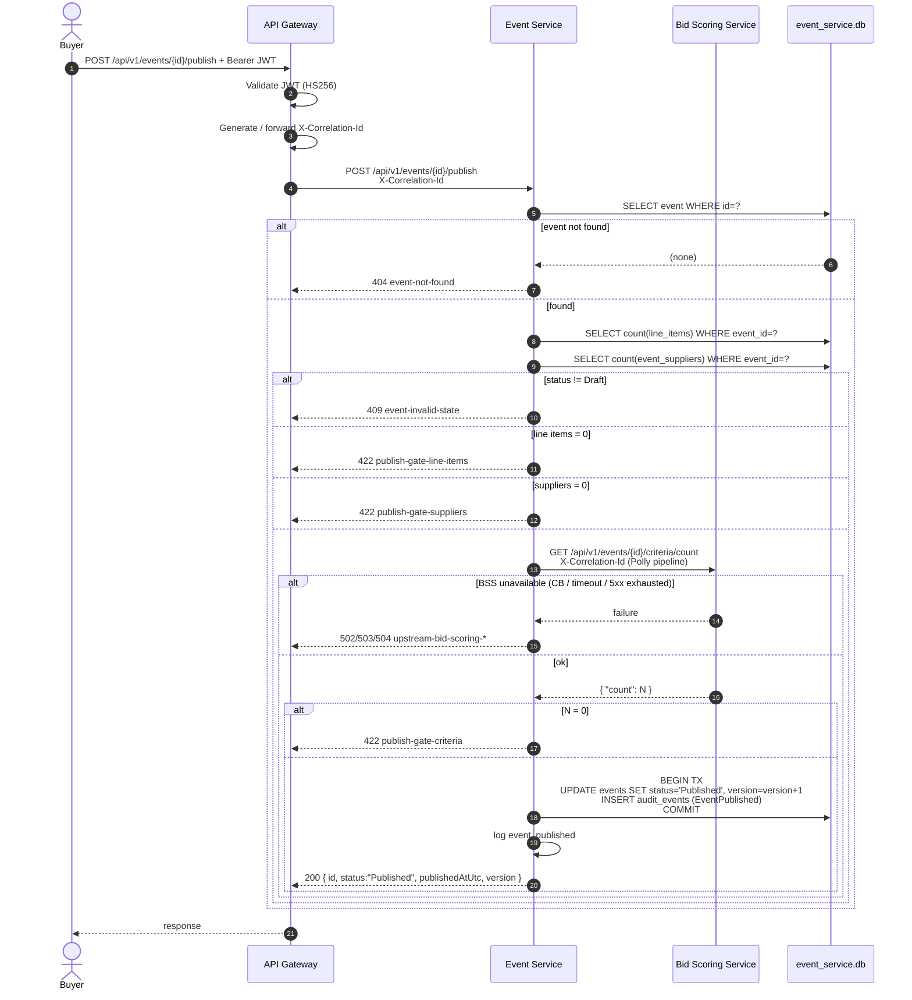
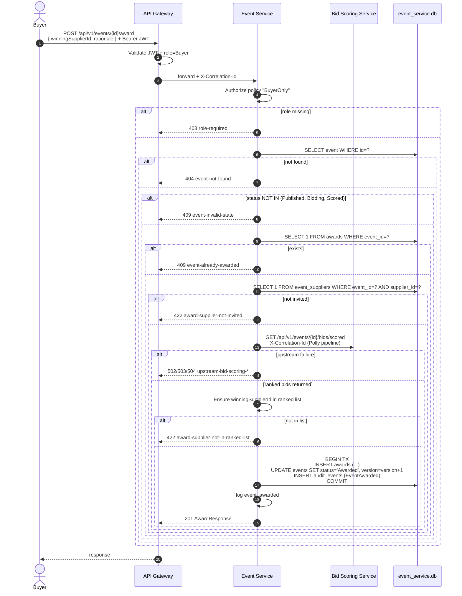

# Low-Level Design (LLD) — Event Service

## RFx Sourcing Event Management

---

### Document Control

| Field             | Value                                                                |
| ----------------- | -------------------------------------------------------------------- |
| Document Title    | LLD — Event Service                                                  |
| Version           | 0.1 (Draft)                                                          |
| Status            | For Development Review                                               |
| Author            | Ramkumar (Solution Architect)                                        |
| Date              | 05 May 2026                                                          |
| Related Artefacts | [BRD.md](BRD.md), [HLD.md](HLD.md), [lld-deliverable-prompt.md](lld-deliverable-prompt.md) |
| Intended Audience | Development Team, Test Team, Technical Leads                         |
| Service           | Event Service (.NET 8 + ASP.NET Core)                                |
| Listening Port    | 5001                                                                 |
| Database          | `event_service.db` (SQLite, file-based)                              |

---

## Table of Contents

1. [Document Purpose & Scope](#1-document-purpose--scope)
2. [Project Structure](#2-project-structure)
3. [Modular Structure](#3-modular-structure)
4. [Database Schema](#4-database-schema)
5. [REST Endpoints — Summary](#5-rest-endpoints--summary)
6. [Request & Response Structures](#6-request--response-structures)
7. [OpenAPI 3.1 Documentation Surface](#7-openapi-31-documentation-surface)
8. [Error Model — RFC 7807 Problem Details](#8-error-model--rfc-7807-problem-details)
9. [Cross-Cutting Concerns](#9-cross-cutting-concerns)
10. [Authentication & Authorisation](#10-authentication--authorisation)
11. [Resilience — Retry / Circuit Breaker / Timeout / Bulkhead](#11-resilience--retry--circuit-breaker--timeout--bulkhead)
12. [Health Endpoint Contract](#12-health-endpoint-contract)
13. [Sequence Diagrams — Core Endpoints](#13-sequence-diagrams--core-endpoints)
14. [External Dependencies / Packages](#14-external-dependencies--packages)
15. [Seed Data Specification](#15-seed-data-specification)
16. [Feature Traceability Matrix](#16-feature-traceability-matrix)
17. [Configuration Reference](#17-configuration-reference)
18. [Open Items / Deferred to Implementation](#18-open-items--deferred-to-implementation)

---

## 1. Document Purpose & Scope

This document is the **Low-Level Design (LLD)** of the Event Service, one of the two microservices defined in the [HLD](HLD.md) for the RFx Sourcing capability. It is the build-time reference for developers implementing this service.

**In scope:** project layout, module responsibilities, database schema, REST endpoints with request/response shapes and field-level rules, error model, cross-cutting wiring, JWT trust, the resilience pipeline applied to east-west calls, the seed dataset, and the configuration surface.

**Out of scope:** source code, build scripts, the API Gateway (YARP-config only per HLD §3.1), the pre-built Auth Service, the Bid Scoring Service (covered in its own LLD).

### 1.1 Service Responsibility

The Event Service owns the **sourcing-event lifecycle** and the **organisation-wide supplier master list**. It is the primary control plane for buyers and is the only initiator of east-west calls to the Bid Scoring Service in the publish and award flows.

| Owns                                                | Does Not Own                                       |
| --------------------------------------------------- | -------------------------------------------------- |
| Events, line items, supplier master list, per-event invitations, awards, audit events. | Scoring criteria, bids, scoring computation, ranked results. |

---

## 2. Project Structure

The Event Service is a single .NET 8 ASP.NET Core Web API project plus a sibling test project. It lives under `services/event-service/` in the mono-repo (HLD §12.2).

```
services/event-service/
├── EventService.csproj
├── Program.cs
├── appsettings.json
├── appsettings.Development.json
├── Controllers/
│   ├── EventsController.cs
│   ├── LineItemsController.cs
│   ├── InvitationsController.cs
│   ├── AwardsController.cs
│   ├── SuppliersController.cs
│   └── HealthController.cs
├── Services/
│   ├── IEventService.cs / EventService.cs
│   ├── ILineItemService.cs / LineItemService.cs
│   ├── IInvitationService.cs / InvitationService.cs
│   ├── IAwardService.cs / AwardService.cs
│   ├── ISupplierService.cs / SupplierService.cs
│   ├── IAuditService.cs / AuditService.cs
│   └── IBidScoringClient.cs            (typed east-west client interface)
├── Repositories/
│   ├── EventDbContext.cs
│   ├── IEventRepository.cs / EventRepository.cs
│   ├── ILineItemRepository.cs / LineItemRepository.cs
│   ├── IInvitationRepository.cs / InvitationRepository.cs
│   ├── IAwardRepository.cs / AwardRepository.cs
│   ├── ISupplierRepository.cs / SupplierRepository.cs
│   └── IAuditRepository.cs / AuditRepository.cs
├── Domain/
│   ├── Entities/             (Event, LineItem, Supplier, EventSupplier, Award, AuditEvent)
│   ├── Enums/                (EventStatus, AuditAction)
│   └── ValueObjects/         (Money, etc.)
├── Infrastructure/
│   ├── Auth/                 (JWT bearer config, Buyer policy)
│   ├── Errors/               (Problem Details middleware, exception map)
│   ├── Logging/              (Serilog config, correlation enrichment)
│   ├── Http/                 (BidScoringClient, resilience pipeline, options)
│   ├── Persistence/          (Migrations, seed runner)
│   └── Validation/           (FluentValidation registrations)
├── Migrations/               (EF Core generated migration files)
├── tests/
│   └── EventService.Tests/
│       ├── EventService.Tests.csproj
│       ├── Unit/
│       └── Integration/
└── README.md
```

---

## 3. Modular Structure

The service follows the four-layer architecture defined in HLD §5.3. Each layer has a single responsibility; cross-layer leakage (e.g., Controller talking to Repository) is prohibited.



### 3.1 Layer Responsibilities

| Layer            | Responsibility                                                                                                  | Forbidden                                                          |
| ---------------- | --------------------------------------------------------------------------------------------------------------- | ------------------------------------------------------------------ |
| Controller       | Bind & validate request, delegate to a single Service call, map result to status code/Problem Details. No logic.| Database access, calling other Controllers, business rules.       |
| Service          | Business rules, orchestration, transaction boundaries, audit emission, invocation of east-west clients.         | Direct DbContext access, controller concerns (HTTP, status codes). |
| Repository       | EF Core persistence, query composition, returns Domain entities only.                                           | HTTP, business logic, validation.                                  |
| Domain           | Entities, enums, value objects, invariant guards.                                                               | Persistence, HTTP, configuration.                                  |
| Infrastructure   | Cross-cutting concerns: middleware, HTTP clients, resilience, logging, JWT.                                     | Business logic.                                                    |

### 3.2 Module Map

| Module                | Owns                                                                          | Talks to                                              |
| --------------------- | ----------------------------------------------------------------------------- | ----------------------------------------------------- |
| Events                | Event entity, lifecycle transitions.                                          | LineItem, Invitation, Audit, BidScoringClient (publish). |
| LineItems             | Line item entity, ordering.                                                   | Events (parent reference).                            |
| Invitations           | EventSupplier join entity.                                                    | Events, Suppliers.                                    |
| Awards                | Award entity, award rules, transition to Awarded.                             | Events, Invitations, BidScoringClient (ranked bids), Audit. |
| Suppliers             | Master supplier list (read-mostly; seeded).                                   | —                                                     |
| Audit                 | Persisted lifecycle audit table; mirror of named log events.                  | All services emit through it.                         |
| BidScoringClient      | Typed HttpClient: criteria-count, ranked-bids endpoints. Carries Polly pipeline. | External Bid Scoring Service.                       |

---

## 4. Database Schema

### 4.1 ER Diagram



### 4.2 Tables

#### 4.2.1 `events`

| Column                | Type     | Constraints                             | Notes                                                |
| --------------------- | -------- | --------------------------------------- | ---------------------------------------------------- |
| id                    | TEXT     | PK, NOT NULL                            | UUIDv7.                                              |
| title                 | TEXT     | NOT NULL, length 3–200                  |                                                      |
| category              | TEXT     | NOT NULL, length 2–80                   | Free-form domain label (e.g., "IT Services").        |
| currency              | TEXT     | NOT NULL, length = 3, default 'INR'     | ISO 4217. INR-only for this release.                 |
| response_deadline_utc | TEXT     | NOT NULL                                | ISO-8601 UTC. Must be in the future at create time.  |
| status                | TEXT     | NOT NULL, default 'Draft'               | One of `EventStatus` enum.                           |
| created_by_sub        | TEXT     | NOT NULL                                | JWT `sub` claim.                                     |
| created_at_utc        | TEXT     | NOT NULL                                | ISO-8601 UTC.                                        |
| updated_at_utc        | TEXT     | NOT NULL                                | ISO-8601 UTC, updated on every mutation.             |
| version               | INTEGER  | NOT NULL, default 1                     | Optimistic concurrency token; bumped per update.     |

**Indexes:** `idx_events_status (status)`, `idx_events_created_by (created_by_sub)`.

#### 4.2.2 `line_items`

| Column         | Type    | Constraints                                          |
| -------------- | ------- | ---------------------------------------------------- |
| id             | TEXT    | PK, UUIDv7.                                          |
| event_id       | TEXT    | FK → events(id), NOT NULL, ON DELETE RESTRICT.       |
| description    | TEXT    | NOT NULL, length 3–500.                              |
| quantity       | REAL    | NOT NULL, > 0.                                       |
| uom            | TEXT    | NOT NULL, length 1–20 (e.g., "EA", "Hours", "Kg").  |
| sort_order     | INTEGER | NOT NULL, default 0.                                 |
| created_at_utc | TEXT    | NOT NULL.                                            |

**Indexes:** `idx_line_items_event (event_id, sort_order)`.

#### 4.2.3 `suppliers`

| Column         | Type    | Constraints                                          |
| -------------- | ------- | ---------------------------------------------------- |
| id             | TEXT    | PK, UUIDv7.                                          |
| name           | TEXT    | NOT NULL, UNIQUE (case-insensitive), length 2–200.   |
| contact_email  | TEXT    | NOT NULL, valid email format.                        |
| is_active      | INTEGER | NOT NULL, default 1.                                 |
| created_at_utc | TEXT    | NOT NULL.                                            |

**Indexes:** `idx_suppliers_name (name)` (case-insensitive collation).

#### 4.2.4 `event_suppliers`

Composite-key join. One row per invitation.

| Column          | Type | Constraints                                |
| --------------- | ---- | ------------------------------------------ |
| event_id        | TEXT | PK part 1, FK → events(id), ON DELETE RESTRICT. |
| supplier_id     | TEXT | PK part 2, FK → suppliers(id), ON DELETE RESTRICT. |
| invited_at_utc  | TEXT | NOT NULL.                                  |
| invited_by_sub  | TEXT | NOT NULL.                                  |

**Indexes:** PK is composite (`event_id`, `supplier_id`). Implicit reverse index `idx_event_suppliers_supplier (supplier_id)`.

#### 4.2.5 `awards`

| Column                | Type | Constraints                                          |
| --------------------- | ---- | ---------------------------------------------------- |
| id                    | TEXT | PK, UUIDv7.                                          |
| event_id              | TEXT | FK → events(id), NOT NULL, **UNIQUE** (one award per event). |
| winning_supplier_id   | TEXT | FK → suppliers(id), NOT NULL.                       |
| rationale             | TEXT | NOT NULL, length 1–1000.                             |
| awarded_at_utc        | TEXT | NOT NULL.                                            |
| awarded_by_sub        | TEXT | NOT NULL.                                            |

**Indexes:** PK; UNIQUE on `event_id`.

#### 4.2.6 `audit_events`

| Column          | Type | Constraints                                          |
| --------------- | ---- | ---------------------------------------------------- |
| id              | TEXT | PK, UUIDv7.                                          |
| correlation_id  | TEXT | NOT NULL.                                            |
| event_id        | TEXT | FK → events(id), nullable (some actions, e.g., supplier-master, are not event-scoped). |
| actor_sub       | TEXT | NOT NULL — JWT `sub` of caller.                     |
| action          | TEXT | NOT NULL — `AuditAction` enum.                       |
| payload_json    | TEXT | NOT NULL — JSON snapshot of relevant fields.         |
| occurred_at_utc | TEXT | NOT NULL.                                            |

**Indexes:** `idx_audit_event (event_id)`, `idx_audit_occurred (occurred_at_utc)`, `idx_audit_correlation (correlation_id)`.

### 4.3 Enumerations

#### 4.3.1 `EventStatus`

| Value      | Meaning                                                                |
| ---------- | ---------------------------------------------------------------------- |
| Draft      | Created; line items, invitations being added.                          |
| Published  | Locked structure; awaiting first bid.                                  |
| Bidding    | At least one bid received; bidding open.                               |
| Scored     | Buyer requested scoring (ranked list returned by Bid Scoring).         |
| Awarded    | Award persisted; supplier selected.                                    |
| Closed     | Terminal — bookkeeping closure after Awarded.                          |
| *Cancelled* | *Reserved (HLD §7.4) — out of scope for this release (D5).*           |

#### 4.3.2 `AuditAction`

| Value             | Triggered by                                            |
| ----------------- | ------------------------------------------------------- |
| EventCreated      | `POST /events`                                          |
| LineItemAdded     | `POST /events/{id}/line-items`                          |
| LineItemRemoved   | `DELETE /events/{id}/line-items/{itemId}`               |
| SupplierInvited   | `POST /events/{id}/invitations`                         |
| SupplierUninvited | `DELETE /events/{id}/invitations/{supplierId}`          |
| EventPublished    | `POST /events/{id}/publish`                             |
| EventAwarded      | `POST /events/{id}/award`                               |
| EventClosed       | (deferred — placeholder for post-award close)           |

### 4.4 State Machine

```mermaid
stateDiagram-v2
    [*] --> Draft: POST /events
    Draft --> Draft: add line items / invite suppliers
    Draft --> Published: POST /events/{id}/publish<br/>(passes publish gates)
    Published --> Bidding: first bid POSTed in BSS<br/>(BSS → ES east-west status update is OUT of scope; transition is local on score request)
    Bidding --> Scored: implicit on first GET /scored from BSS
    Scored --> Awarded: POST /events/{id}/award
    Awarded --> Closed: deferred
    Closed --> [*]

    note right of Published
      Cancelled state defined in
      enum but not implemented (D5).
    end note
```



> **Implementation note on Published → Bidding → Scored:** because Event Service does not own bids, the `Bidding` and `Scored` substates are advisory in this release. Award accepts `Published`, `Bidding`, and `Scored` as valid pre-states; the explicit transition to `Awarded` is the only mandatory state write besides Draft → Published.

### 4.5 Migrations

EF Core Migrations are applied **programmatically on service startup**. The startup sequence:

1. Open `EventDbContext`.
2. Apply pending migrations (idempotent).
3. Run seed loader (§15).
4. Begin accepting requests.

Migration file naming follows EF Core's timestamped convention. Concrete migration file lists are not part of the LLD.

---

## 5. REST Endpoints — Summary

All endpoints are mounted under base path `/api/v1`. All are JSON. All require a valid Bearer JWT (validated at the gateway). The Award endpoint additionally requires the `Buyer` role.

| # | Method | Path                                                      | Auth   | Purpose                                          | FR     | Success | Notable Errors          |
| - | ------ | --------------------------------------------------------- | ------ | ------------------------------------------------ | ------ | ------- | ----------------------- |
| 1 | POST   | `/api/v1/events`                                          | Any JWT | Create a new event in Draft state.              | FR-01  | 201     | 400, 422               |
| 2 | GET    | `/api/v1/events`                                          | Any JWT | List events (paginated).                        | FR-10  | 200     | 400 (bad query)        |
| 3 | GET    | `/api/v1/events/{eventId}`                                | Any JWT | Get a single event with summary aggregates.    | FR-10  | 200     | 404                    |
| 4 | POST   | `/api/v1/events/{eventId}/line-items`                     | Any JWT | Add a line item (Draft only).                  | FR-02  | 201     | 404, 409, 422          |
| 5 | GET    | `/api/v1/events/{eventId}/line-items`                     | Any JWT | List line items.                                | FR-02  | 200     | 404                    |
| 6 | DELETE | `/api/v1/events/{eventId}/line-items/{lineItemId}`        | Any JWT | Remove a line item (Draft only).               | FR-02  | 204     | 404, 409                |
| 7 | POST   | `/api/v1/events/{eventId}/invitations`                    | Any JWT | Invite a supplier (Draft only).                | FR-04  | 201     | 404, 409, 422          |
| 8 | GET    | `/api/v1/events/{eventId}/invitations`                    | Any JWT | List invited suppliers.                         | FR-04  | 200     | 404                    |
| 9 | DELETE | `/api/v1/events/{eventId}/invitations/{supplierId}`       | Any JWT | Uninvite a supplier (Draft only).              | FR-04  | 204     | 404, 409                |
| 10| POST   | `/api/v1/events/{eventId}/publish`                        | Any JWT | Transition Draft → Published (gates apply).    | FR-05  | 200     | 404, 409, 422, 502/503/504 |
| 11| POST   | `/api/v1/events/{eventId}/award`                          | **Buyer** | Award the event to a supplier.                | FR-09  | 201     | 403, 404, 409, 422, 502/503/504 |
| 12| GET    | `/api/v1/events/{eventId}/award`                          | Any JWT | Retrieve the award decision.                   | FR-09  | 200     | 404                    |
| 13| GET    | `/api/v1/suppliers`                                       | Any JWT | List master suppliers (paginated).             | FR-04  | 200     | 400                    |
| 14| GET    | `/api/v1/suppliers/{supplierId}`                          | Any JWT | Get a single supplier.                          | FR-04  | 200     | 404                    |
| 15| GET    | `/health`                                                 | None   | Liveness probe.                                  | —      | 200     | —                      |

**Pagination** (D15): list endpoints accept `?limit=<1..200>&offset=<>=0>` with defaults `limit=50`, `offset=0`. Out-of-range values yield `400`.

---

## 6. Request & Response Structures

Each endpoint below includes a JSON request body example (where applicable), a JSON response body example, and a field-level table. All timestamps are ISO-8601 UTC. All IDs are UUIDv7 strings. All currency amounts are in INR for this release (no `currency` field on bids/awards because event-level currency is canonical).

### 6.1 Create Event — `POST /api/v1/events`

**Request body**

```json
{
  "title": "Cloud Hosting Services FY27",
  "category": "IT Services",
  "currency": "INR",
  "responseDeadlineUtc": "2026-06-30T17:00:00Z"
}
```

| Field                | Type   | Required | Constraints                          | Description                                      |
| -------------------- | ------ | -------- | ------------------------------------ | ------------------------------------------------ |
| title                | string | yes      | 3–200 chars                          | Human-readable event name.                       |
| category             | string | yes      | 2–80 chars                           | Domain label (free-form).                        |
| currency             | string | no       | ISO 4217; default `"INR"`            | INR-only enforced (BRD A4).                      |
| responseDeadlineUtc  | string | yes      | ISO-8601 UTC; must be in the future  | When supplier responses are due.                 |

**Response — 201 Created**

```json
{
  "id": "0190a1b3-c0c0-7a01-9d4f-3e2c1a8b0001",
  "title": "Cloud Hosting Services FY27",
  "category": "IT Services",
  "currency": "INR",
  "responseDeadlineUtc": "2026-06-30T17:00:00Z",
  "status": "Draft",
  "createdBySub": "buyer-001",
  "createdAtUtc": "2026-05-05T10:14:32Z",
  "updatedAtUtc": "2026-05-05T10:14:32Z",
  "version": 1
}
```

| Field      | Type   | Description                          |
| ---------- | ------ | ------------------------------------ |
| id         | string | UUIDv7 of the created event.         |
| status     | string | Always `"Draft"` from this endpoint. |
| version    | int    | Optimistic concurrency token.        |

`Location` response header set to `/api/v1/events/{id}`.

---

### 6.2 List Events — `GET /api/v1/events`

**Query parameters**

| Param  | Type   | Default | Constraints   | Description                            |
| ------ | ------ | ------- | ------------- | -------------------------------------- |
| limit  | int    | 50      | 1–200         | Page size.                             |
| offset | int    | 0       | ≥ 0           | Page offset.                           |
| status | string | (none)  | EventStatus value | Optional filter.                   |

**Response — 200 OK**

```json
{
  "items": [
    {
      "id": "0190a1b3-c0c0-7a01-9d4f-3e2c1a8b0001",
      "title": "Cloud Hosting Services FY27",
      "category": "IT Services",
      "currency": "INR",
      "responseDeadlineUtc": "2026-06-30T17:00:00Z",
      "status": "Draft",
      "createdAtUtc": "2026-05-05T10:14:32Z"
    }
  ],
  "limit": 50,
  "offset": 0,
  "total": 1
}
```

---

### 6.3 Get Event — `GET /api/v1/events/{eventId}`

**Response — 200 OK**

```json
{
  "id": "0190a1b3-c0c0-7a01-9d4f-3e2c1a8b0001",
  "title": "Cloud Hosting Services FY27",
  "category": "IT Services",
  "currency": "INR",
  "responseDeadlineUtc": "2026-06-30T17:00:00Z",
  "status": "Published",
  "createdBySub": "buyer-001",
  "createdAtUtc": "2026-05-05T10:14:32Z",
  "updatedAtUtc": "2026-05-05T11:00:00Z",
  "version": 4,
  "summary": {
    "lineItemCount": 3,
    "invitedSupplierCount": 4,
    "isAwarded": false
  }
}
```

---

### 6.4 Add Line Item — `POST /api/v1/events/{eventId}/line-items`

**Request body**

```json
{
  "description": "Standard VM, 4 vCPU / 16 GB",
  "quantity": 25,
  "uom": "EA",
  "sortOrder": 1
}
```

| Field       | Type   | Required | Constraints              |
| ----------- | ------ | -------- | ------------------------ |
| description | string | yes      | 3–500 chars              |
| quantity    | number | yes      | > 0                      |
| uom         | string | yes      | 1–20 chars               |
| sortOrder   | int    | no       | ≥ 0; default 0           |

**Response — 201 Created**

```json
{
  "id": "0190a1b3-c0c0-7a02-aa10-77a0c1b30001",
  "eventId": "0190a1b3-c0c0-7a01-9d4f-3e2c1a8b0001",
  "description": "Standard VM, 4 vCPU / 16 GB",
  "quantity": 25,
  "uom": "EA",
  "sortOrder": 1,
  "createdAtUtc": "2026-05-05T10:16:01Z"
}
```

**Errors:** 404 (event not found); 409 (event not in Draft); 422 (validation).

---

### 6.5 List Line Items — `GET /api/v1/events/{eventId}/line-items`

Pagination identical to §6.2. Items sorted by `sortOrder`, then `createdAtUtc`.

---

### 6.6 Remove Line Item — `DELETE /api/v1/events/{eventId}/line-items/{lineItemId}`

**Response — 204 No Content.**

**Errors:** 404 (not found); 409 (event not in Draft).

---

### 6.7 Invite Supplier — `POST /api/v1/events/{eventId}/invitations`

**Request body**

```json
{
  "supplierId": "0190a1b3-c0c0-7b01-9d4f-aa11bb22cc01"
}
```

| Field      | Type   | Required | Constraints                     |
| ---------- | ------ | -------- | ------------------------------- |
| supplierId | string | yes      | UUIDv7; must exist in master    |

**Response — 201 Created**

```json
{
  "eventId": "0190a1b3-c0c0-7a01-9d4f-3e2c1a8b0001",
  "supplierId": "0190a1b3-c0c0-7b01-9d4f-aa11bb22cc01",
  "supplierName": "Acme Cloud Pvt Ltd",
  "invitedAtUtc": "2026-05-05T10:18:00Z",
  "invitedBySub": "buyer-001"
}
```

**Errors:** 404 (event or supplier not found); 409 (event not Draft, supplier already invited); 422 (validation).

---

### 6.8 List Invitations — `GET /api/v1/events/{eventId}/invitations`

**Response — 200 OK**

```json
{
  "items": [
    {
      "supplierId": "0190a1b3-c0c0-7b01-9d4f-aa11bb22cc01",
      "supplierName": "Acme Cloud Pvt Ltd",
      "invitedAtUtc": "2026-05-05T10:18:00Z"
    }
  ],
  "limit": 50,
  "offset": 0,
  "total": 1
}
```

---

### 6.9 Uninvite Supplier — `DELETE /api/v1/events/{eventId}/invitations/{supplierId}`

**Response — 204 No Content.**
**Errors:** 404, 409 (event not Draft).

---

### 6.10 Publish Event — `POST /api/v1/events/{eventId}/publish`

No request body.

**Response — 200 OK**

```json
{
  "id": "0190a1b3-c0c0-7a01-9d4f-3e2c1a8b0001",
  "status": "Published",
  "publishedAtUtc": "2026-05-05T10:30:00Z",
  "version": 4
}
```

**Pre-publish gates (D8):**

1. Event is in `Draft`.
2. ≥ 1 line item exists locally.
3. ≥ 1 supplier invited locally.
4. East-west call to Bid Scoring confirms ≥ 1 criterion exists for the event.

**Errors**

| Status | Slug                          | When                                                              |
| ------ | ----------------------------- | ----------------------------------------------------------------- |
| 404    | event-not-found               | No event with that id.                                            |
| 409    | event-invalid-state           | Event not in Draft.                                               |
| 422    | publish-gate-line-items       | No line items.                                                    |
| 422    | publish-gate-suppliers        | No supplier invitations.                                          |
| 422    | publish-gate-criteria         | Bid Scoring reports zero criteria.                                |
| 502    | upstream-bid-scoring-failed   | Bid Scoring returned 5xx after retries.                           |
| 503    | upstream-bid-scoring-unavailable | Circuit breaker open.                                          |
| 504    | upstream-bid-scoring-timeout  | Polly timeout exceeded.                                           |

---

### 6.11 Award Event — `POST /api/v1/events/{eventId}/award`

**Auth:** Bearer JWT **+ role `Buyer`** (D13).

**Request body**

```json
{
  "winningSupplierId": "0190a1b3-c0c0-7b01-9d4f-aa11bb22cc01",
  "rationale": "Best score on weighted criteria (price + lead time + quality)."
}
```

| Field             | Type   | Required | Constraints                                          |
| ----------------- | ------ | -------- | ---------------------------------------------------- |
| winningSupplierId | string | yes      | UUIDv7; must be on the event's invitation list AND in the ranked list returned by Bid Scoring. |
| rationale         | string | yes      | 1–1000 chars (D4).                                   |

**Response — 201 Created**

```json
{
  "id": "0190a1b3-c0c0-7c01-9d4f-aa11bb22ee01",
  "eventId": "0190a1b3-c0c0-7a01-9d4f-3e2c1a8b0001",
  "winningSupplierId": "0190a1b3-c0c0-7b01-9d4f-aa11bb22cc01",
  "winningSupplierName": "Acme Cloud Pvt Ltd",
  "rationale": "Best score on weighted criteria (price + lead time + quality).",
  "awardedAtUtc": "2026-05-05T11:45:10Z",
  "awardedBySub": "buyer-001",
  "eventStatusAfter": "Awarded"
}
```

**Award guards (executed in order):**

1. Event exists.
2. Event status ∈ {`Published`, `Bidding`, `Scored`}.
3. No prior award for this event (`awards.event_id` UNIQUE).
4. Winning supplier is on the invitation list.
5. East-west call: ranked bids retrieved from Bid Scoring; winning supplier is in that ranked list.
6. Persist award; transition event to `Awarded`; bump `version`.
7. Write `EventAwarded` audit row.

**Errors**

| Status | Slug                                | When                                                          |
| ------ | ----------------------------------- | ------------------------------------------------------------- |
| 403    | role-required                       | JWT lacks `Buyer` role.                                       |
| 404    | event-not-found                     | No event.                                                     |
| 409    | event-already-awarded               | Award already exists for this event.                          |
| 409    | event-invalid-state                 | Event status not awardable.                                   |
| 422    | award-supplier-not-invited          | Winning supplier not on invitation list.                      |
| 422    | award-supplier-not-in-ranked-list   | Winning supplier absent from ranked bids returned by BSS.     |
| 502/503/504 | upstream-bid-scoring-*           | East-west failures (same slugs as §6.10).                     |

---

### 6.12 Get Award — `GET /api/v1/events/{eventId}/award`

**Response — 200 OK** — same shape as §6.11 response.
**Errors:** 404 (event has no award yet, or event not found).

---

### 6.13 List Suppliers — `GET /api/v1/suppliers`

Paginated list. Optional `?activeOnly=true` filter (default true).

```json
{
  "items": [
    {
      "id": "0190a1b3-c0c0-7b01-9d4f-aa11bb22cc01",
      "name": "Acme Cloud Pvt Ltd",
      "contactEmail": "sales@acmecloud.example",
      "isActive": true
    }
  ],
  "limit": 50,
  "offset": 0,
  "total": 1
}
```

---

### 6.14 Get Supplier — `GET /api/v1/suppliers/{supplierId}`

Single supplier; same shape as one item in §6.13.

---

### 6.15 Health — `GET /health`

```json
{ "status": "ok" }
```

See §12 for full contract.

---

## 7. OpenAPI 3.1 Documentation Surface

The Event Service publishes OpenAPI 3.1 at `/swagger/v1/swagger.json` and a Swagger UI at `/swagger`. The spec file authored under `contracts/event-service/v1/openapi.yaml` (HLD §8.2) is the **source of truth**; the runtime-generated spec is reconciled against it in CI (deferred).

This section is the **catalogue** of OpenAPI components. Full YAML/JSON is intentionally out of scope (D18).

### 7.1 OpenAPI Document Skeleton

| Section                | Content                                                                               |
| ---------------------- | ------------------------------------------------------------------------------------- |
| `openapi`              | `3.1.0`                                                                               |
| `info.title`           | `Event Service API`                                                                   |
| `info.version`         | `1.0.0`                                                                               |
| `info.description`     | "RFx sourcing event lifecycle. See HLD/LLD for context."                              |
| `servers[0].url`       | `http://localhost:5000` (gateway) and `http://localhost:5001` (direct, dev only)     |
| `security` (default)   | `bearerAuth: []`                                                                      |
| `tags`                 | Events, LineItems, Invitations, Awards, Suppliers, Health.                            |

### 7.2 Path Catalogue

The `paths` object enumerates the 15 endpoints in §5. Each operation carries: `operationId`, `tags`, `summary`, `parameters`, `requestBody` (if any), `responses` (200/201/204 + 4xx/5xx mapped to Problem Details), and `security` (default `bearerAuth`; Award additionally requires `Buyer` scope/role declaration).

| operationId             | Method | Path                                              |
| ----------------------- | ------ | ------------------------------------------------- |
| createEvent             | POST   | /api/v1/events                                    |
| listEvents              | GET    | /api/v1/events                                    |
| getEvent                | GET    | /api/v1/events/{eventId}                          |
| addLineItem             | POST   | /api/v1/events/{eventId}/line-items               |
| listLineItems           | GET    | /api/v1/events/{eventId}/line-items               |
| removeLineItem          | DELETE | /api/v1/events/{eventId}/line-items/{lineItemId}  |
| inviteSupplier          | POST   | /api/v1/events/{eventId}/invitations              |
| listInvitations         | GET    | /api/v1/events/{eventId}/invitations              |
| uninviteSupplier        | DELETE | /api/v1/events/{eventId}/invitations/{supplierId} |
| publishEvent            | POST   | /api/v1/events/{eventId}/publish                  |
| awardEvent              | POST   | /api/v1/events/{eventId}/award                    |
| getAward                | GET    | /api/v1/events/{eventId}/award                    |
| listSuppliers           | GET    | /api/v1/suppliers                                 |
| getSupplier             | GET    | /api/v1/suppliers/{supplierId}                    |
| getHealth               | GET    | /health                                           |

### 7.3 Component Schema Catalogue

`components.schemas`:

| Schema name           | Used in                                                |
| --------------------- | ------------------------------------------------------ |
| EventCreateRequest    | createEvent request body.                              |
| EventResponse         | createEvent / getEvent response.                       |
| EventSummary          | listEvents `items[]`.                                  |
| EventListResponse     | listEvents response envelope.                          |
| LineItemCreateRequest | addLineItem request body.                              |
| LineItemResponse      | addLineItem / listLineItems item.                      |
| LineItemListResponse  | listLineItems response envelope.                       |
| InvitationCreateRequest | inviteSupplier request body.                         |
| InvitationResponse    | inviteSupplier / listInvitations item.                 |
| InvitationListResponse | listInvitations envelope.                             |
| PublishResponse       | publishEvent response.                                 |
| AwardCreateRequest    | awardEvent request body.                               |
| AwardResponse         | awardEvent / getAward response.                        |
| SupplierResponse      | getSupplier response & listSuppliers items.            |
| SupplierListResponse  | listSuppliers envelope.                                |
| HealthResponse        | getHealth response.                                    |
| ProblemDetails        | All 4xx/5xx responses (RFC 7807, see §8).              |
| PaginationEnvelope    | Common shape for list responses (`limit`, `offset`, `total`). |

### 7.4 Component Security Schemes

```
components.securitySchemes:
  bearerAuth:
    type: http
    scheme: bearer
    bearerFormat: JWT
```

### 7.5 Tag Definitions

| Tag        | Description                                    |
| ---------- | ---------------------------------------------- |
| Events     | Event lifecycle (create, get, list, publish).  |
| LineItems  | Line items belonging to an event.              |
| Invitations | Supplier invitations on an event.             |
| Awards     | Award decision on an event.                    |
| Suppliers  | Supplier master list.                          |
| Health     | Liveness probe.                                |

---

## 8. Error Model — RFC 7807 Problem Details

All non-2xx responses (except `204`) return `application/problem+json` per RFC 7807.

### 8.1 Common Body Shape

```json
{
  "type": "https://rfx-sourcing/problems/event-invalid-state",
  "title": "Event is not in a state that allows this operation",
  "status": 409,
  "detail": "Event is in 'Awarded'; expected one of: Draft.",
  "instance": "/api/v1/events/0190a1b3-c0c0-7a01-9d4f-3e2c1a8b0001/line-items",
  "correlationId": "1f2e3d4c-5b6a-7980-1122-334455667788",
  "errors": [
    { "field": "status", "message": "Expected Draft." }
  ]
}
```

| Field          | Type   | Required | Meaning                                                                  |
| -------------- | ------ | -------- | ------------------------------------------------------------------------ |
| type           | string | yes      | URI identifying the problem class (slug-based, see §8.3).                |
| title          | string | yes      | Short, human-readable summary.                                           |
| status         | int    | yes      | HTTP status code (mirrors response status).                              |
| detail         | string | yes      | Specific explanation for this occurrence.                                |
| instance       | string | yes      | The request path that produced the error.                                |
| correlationId  | string | yes      | Mirrors the inbound `X-Correlation-Id` for cross-log lookup (§9).        |
| errors         | array  | no       | Field-level validation errors; present on 400/422.                       |

`errors[]` items: `{ "field": string, "message": string }`.

### 8.2 HTTP Status Mapping

| Status | Trigger                                                                                       |
| ------ | --------------------------------------------------------------------------------------------- |
| 400    | Malformed request (deserialisation failure, bad query params).                                |
| 401    | Missing/invalid JWT (raised at the gateway; service does not re-validate per HLD §9.2).      |
| 403    | Authenticated but lacks role `Buyer` (Award only).                                           |
| 404    | Resource not found.                                                                          |
| 409    | State-machine violation, uniqueness violation.                                               |
| 422    | Semantic validation failure (publish gates, supplier-not-invited, etc.).                     |
| 500    | Unhandled server error (default catch-all).                                                  |
| 502    | Bid Scoring returned 5xx after retries exhausted.                                            |
| 503    | Polly circuit breaker open OR service shutting down.                                         |
| 504    | Polly per-attempt timeout exceeded after retries.                                            |

### 8.3 Slug Catalogue (Event Service)

`type` URIs use `https://rfx-sourcing/problems/<slug>`. Both services share this taxonomy where applicable.

| Slug                                 | Status  | Surface                                              |
| ------------------------------------ | ------- | ---------------------------------------------------- |
| validation-failed                    | 400/422 | Generic validation envelope (with `errors[]`).       |
| event-not-found                      | 404     | Any event-id lookup miss.                            |
| supplier-not-found                   | 404     | Any supplier-id lookup miss.                         |
| line-item-not-found                  | 404     | Line-item-id lookup miss.                            |
| invitation-not-found                 | 404     | Supplier not invited to event.                       |
| award-not-found                      | 404     | `GET /events/{id}/award` when no award.              |
| event-invalid-state                  | 409     | State-machine violation.                             |
| event-already-awarded                | 409     | Second award attempt.                                |
| supplier-already-invited             | 409     | Duplicate invitation.                                |
| publish-gate-line-items              | 422     | Publish: zero line items.                            |
| publish-gate-suppliers               | 422     | Publish: zero suppliers.                             |
| publish-gate-criteria                | 422     | Publish: BSS reports zero criteria.                  |
| award-supplier-not-invited           | 422     | Award: supplier not on invitation list.              |
| award-supplier-not-in-ranked-list    | 422     | Award: supplier not in ranked bids.                  |
| role-required                        | 403     | Role gate fail (Award).                              |
| upstream-bid-scoring-failed          | 502     | BSS 5xx after retries.                               |
| upstream-bid-scoring-unavailable     | 503     | Circuit breaker open.                                |
| upstream-bid-scoring-timeout         | 504     | Per-attempt timeout exceeded.                        |
| internal-error                       | 500     | Catch-all for unhandled exceptions.                  |

### 8.4 Exception → Status Mapping (registered in middleware)

| .NET exception type             | Maps to | Slug                                |
| ------------------------------- | ------- | ----------------------------------- |
| `ValidationException` (FluentValidation) | 422  | validation-failed                  |
| `NotFoundException` (custom)    | 404     | resource-specific (per type discriminator) |
| `ConflictException` (custom)    | 409     | state/uniqueness slug per discriminator |
| `ForbiddenRoleException`        | 403     | role-required                       |
| `UpstreamFailureException`      | 502/503/504 | upstream-bid-scoring-*           |
| `Exception` (fallback)          | 500     | internal-error                      |

---

## 9. Cross-Cutting Concerns

### 9.1 Structured Logging (Serilog)

- Sink: console, JSON formatted (`Serilog.Formatting.Compact.CompactJsonFormatter`).
- Minimum level: `Information` (default), `Debug` in `Development`.
- Enrichers: `WithMachineName`, `WithThreadId`, `WithCorrelationId`, `WithProperty("service", "event-service")`, `WithProperty("version", "<assembly version>")`.
- Each log entry carries: timestamp, level, message, correlationId, service, plus per-event structured properties.

#### 9.1.1 Named Lifecycle Log Events

These names match the audit-table `action` enum (§4.3.2). They are the substrate for FR-12 traceability.

| Event name           | Level | Properties                                                            |
| -------------------- | ----- | --------------------------------------------------------------------- |
| `event_created`      | INFO  | eventId, title, category, createdBySub                                |
| `line_item_added`    | INFO  | eventId, lineItemId                                                   |
| `line_item_removed`  | INFO  | eventId, lineItemId                                                   |
| `supplier_invited`   | INFO  | eventId, supplierId                                                   |
| `supplier_uninvited` | INFO  | eventId, supplierId                                                   |
| `event_published`    | INFO  | eventId, lineItemCount, invitedCount, criteriaCount                   |
| `event_awarded`      | INFO  | eventId, awardId, winningSupplierId                                   |
| `upstream_call`      | DEBUG | target, operation, durationMs, statusCode, attempt                    |
| `upstream_failure`   | WARN  | target, operation, statusCode/exceptionType, attempt                  |
| `unhandled_error`    | ERROR | exceptionType, message, stack                                         |

### 9.2 Correlation IDs

- Inbound header: `X-Correlation-Id`.
- If absent (e.g., direct-port testing), service generates a UUIDv4.
- Propagated **outbound** to Bid Scoring on every east-west call.
- Captured in: every log entry (via Serilog enricher), every `audit_events` row, every Problem Details body.

### 9.3 Configuration (`IOptions<T>` typed binding)

Sources, in precedence order: environment variables → `appsettings.{Environment}.json` → `appsettings.json` → User Secrets (Development only).

Typed option classes:

| Options class       | Bound from key            |
| ------------------- | ------------------------- |
| `JwtOptions`        | `Auth:Jwt`                |
| `BidScoringOptions` | `BidScoring`              |
| `ResilienceOptions` | `Resilience`              |
| `SeedOptions`       | `Seed`                    |
| `LoggingOptions`    | `Logging` (Serilog stock) |

See §17 for the full key catalogue.

### 9.4 Validation (FluentValidation)

- One validator per request DTO (e.g., `EventCreateRequestValidator`, `AwardCreateRequestValidator`).
- Registered through `AddValidatorsFromAssembly(...)` in `Program.cs`.
- A single `ValidationFilter`/middleware short-circuits with 422 + `validation-failed` Problem Details.

### 9.5 Audit Persistence

Every named lifecycle event is also persisted to `audit_events`. The Service layer is responsible — Controllers do not write audit. Audit writes happen **inside the same transaction** as the business mutation; the audit row is committed atomically with the change it describes. If the business mutation rolls back, the audit row rolls back too.

### 9.6 Serialization Conventions

- JSON property naming: `camelCase`.
- Nulls omitted (`DefaultIgnoreCondition = WhenWritingNull`).
- Enum values serialised as strings (System.Text.Json `JsonStringEnumConverter`).
- DateTimes serialised as ISO-8601 UTC with `Z` suffix.

---

## 10. Authentication & Authorisation

### 10.1 Trust Model

Per HLD §9.2, JWT validation occurs **only at the API Gateway**. The Event Service trusts the inbound request when reached through the gateway. When reached on its direct port (5001) for local development or testing, the service does not enforce the JWT — this is the documented R1 risk in HLD §18.

### 10.2 Required Claims

The Event Service reads (without re-validating) the following claims:

| Claim    | Read for                                          |
| -------- | ------------------------------------------------- |
| `sub`    | `created_by_sub`, `invited_by_sub`, `awarded_by_sub`, audit `actor_sub`. |
| `roles`  | Role gate on Award (must contain `"Buyer"`).      |
| `exp`    | Logged for diagnostics only; not enforced here.   |

If `sub` is missing on a successful gateway-passed request, the service returns `500 internal-error` (this would indicate a broken gateway).

### 10.3 Role Gate

Only `POST /api/v1/events/{eventId}/award` requires role `Buyer`. Implemented as a controller-level authorization policy:

| Policy name | Requires                                       |
| ----------- | ---------------------------------------------- |
| `BuyerOnly` | Authenticated AND `roles` claim contains `"Buyer"`. |

A failed role check returns 403 with slug `role-required`.

### 10.4 Token Algorithm & Secret

- Algorithm: **HS256**.
- Signing key supplied via configuration `Auth:Jwt:SigningKey` (HLD §9.5 — anti-pattern documented in HLD §18 R6).
- Issuer / Audience: configured via `Auth:Jwt:Issuer` / `Auth:Jwt:Audience`. Mismatches cause the JWT to fail at the gateway (out of scope here).

---

## 11. Resilience — Retry / Circuit Breaker / Timeout / Bulkhead

The Event Service is the only east-west **initiator** in the system. Two outbound calls require resilience:

1. `BidScoringClient.GetCriteriaCount(eventId, ct)` — used by Publish.
2. `BidScoringClient.GetRankedBids(eventId, ct)` — used by Award.

Both are wrapped in a single Polly v8 `ResiliencePipeline` registered against the typed `IBidScoringClient` via `AddHttpClient(...).AddResilienceHandler(...)`.

### 11.1 Pipeline Composition

Order is **outermost → innermost** (a request flows top-to-bottom):



**Why this order:**

- **Timeout innermost** so each retry attempt is bounded.
- **Circuit breaker wraps timeout** so a string of timeouts trips the breaker.
- **Retry wraps the breaker** so retries respect breaker state (a retry will short-circuit if the breaker is open).
- **Bulkhead outermost** so it caps total concurrent attempts to the downstream service, regardless of how many retries are in flight.

### 11.2 Default Values (configurable per D12)

All values bind to the `Resilience` section of `appsettings.json`. See §17 for the configuration reference.

| Pattern                     | Default                                           | Rationale                                                                |
| --------------------------- | ------------------------------------------------- | ------------------------------------------------------------------------ |
| Timeout — per attempt       | `5 s`                                             | BRD A7: happy-path < 5 s. Anything longer is failure.                    |
| Retry — count               | `3` (i.e., 1 + 3 = up to 4 attempts)              | Enough to mask transient blips without amplifying load.                  |
| Retry — backoff             | Exponential, base `200 ms`, max `2 s`, with jitter | Industry default; jitter avoids thundering-herd alignment.              |
| Retry — retryable statuses  | `408, 429, 500, 502, 503, 504` + transient `HttpRequestException` / `BrokenCircuit` excluded from retry. | Excludes 4xx that won't change. |
| CB — failure ratio          | `0.5` over `30 s` sampling window                 | Open after 50% failure rate sustained.                                   |
| CB — minimum throughput     | `10` calls in window                              | Avoid premature trip on low traffic.                                     |
| CB — break duration         | `10 s`                                            | Half-open probe after 10 s.                                              |
| Bulkhead — max concurrent   | `10`                                              | Caps simultaneous east-west calls.                                       |
| Bulkhead — max queued       | `20`                                              | Bounded queue ahead of bulkhead; excess fast-fails with 503.             |

### 11.3 Failure Surface

Polly outcomes map to HTTP responses returned to the caller of Event Service:

| Polly outcome                      | Returned as                                  |
| ---------------------------------- | -------------------------------------------- |
| `BrokenCircuitException`           | 503 `upstream-bid-scoring-unavailable`       |
| `TimeoutRejectedException`         | 504 `upstream-bid-scoring-timeout`           |
| `BulkheadRejectedException`        | 503 `upstream-bid-scoring-unavailable`       |
| Final attempt 5xx                  | 502 `upstream-bid-scoring-failed`            |
| Final attempt non-retryable 4xx    | 502 `upstream-bid-scoring-failed` (with original status in `detail`) |

### 11.4 Logging Hooks

Each Polly handler emits a log line (see §9.1.1):

- On retry: `upstream_call` at DEBUG with `attempt` ≥ 2.
- On retry exhaustion / breaker open / timeout / bulkhead reject: `upstream_failure` at WARN.

### 11.5 Bid Scoring Client Surface

The typed client `IBidScoringClient` exposes two operations only. Resilience is applied uniformly to both.

| Operation         | Verb + Path on BSS                                        | Returns                                       |
| ----------------- | --------------------------------------------------------- | --------------------------------------------- |
| GetCriteriaCount  | `GET /api/v1/events/{eventId}/criteria/count`             | `{ "eventId": "...", "count": <int> }`        |
| GetRankedBids     | `GET /api/v1/events/{eventId}/bids/scored?limit=200`      | Ranked list (see Bid Scoring LLD §6).         |

`X-Correlation-Id` is forwarded on both.

---

## 12. Health Endpoint Contract

Per D14, the Event Service exposes a single liveness endpoint.

| Field              | Value                              |
| ------------------ | ---------------------------------- |
| Method             | `GET`                              |
| Path               | `/health`                          |
| Authentication     | None.                              |
| Status code (live) | 200 OK.                            |
| Response body      | `{"status":"ok"}`                  |
| Side effects       | None. Does not touch DB or BSS.    |
| Cache headers      | `Cache-Control: no-store`.         |

If the process is unable to serve requests (e.g., during graceful shutdown), the endpoint returns 503 `{"status":"shutting-down"}`. Liveness/readiness split is deferred (HLD §11.5).

---

## 13. Sequence Diagrams — Core Endpoints

### 13.1 Publish Event (east-west criteria check)



### 13.2 Award Event (full happy path with all guards)



---

## 14. External Dependencies / Packages

### 14.1 NuGet Packages

| Package                                                         | Version  | Purpose                                                             |
| --------------------------------------------------------------- | -------- | ------------------------------------------------------------------- |
| Microsoft.AspNetCore.OpenApi                                    | 8.x      | OpenAPI 3.1 emission.                                               |
| Swashbuckle.AspNetCore                                          | 6.x      | Swagger UI at `/swagger`.                                           |
| Microsoft.EntityFrameworkCore                                   | 8.x      | EF Core runtime.                                                    |
| Microsoft.EntityFrameworkCore.Sqlite                            | 8.x      | SQLite provider.                                                    |
| Microsoft.EntityFrameworkCore.Design                            | 8.x      | Design-time tooling for migrations.                                 |
| Microsoft.AspNetCore.Authentication.JwtBearer                   | 8.x      | JWT bearer scheme (kept off here; gateway-only validation per HLD). |
| Microsoft.Extensions.Diagnostics.HealthChecks                   | 8.x      | `/health` endpoint.                                                 |
| FluentValidation.AspNetCore                                     | 11.x     | Request validation.                                                 |
| Serilog.AspNetCore                                              | 8.x      | Logging integration.                                                |
| Serilog.Sinks.Console                                           | 5.x      | Console sink.                                                       |
| Serilog.Formatting.Compact                                      | 2.x      | JSON log lines.                                                     |
| Serilog.Enrichers.CorrelationId (or custom enricher)            | 3.x      | Correlation ID enrichment.                                          |
| Polly                                                           | 8.x      | Resilience pipelines.                                               |
| Microsoft.Extensions.Http.Resilience                            | 8.x      | `AddResilienceHandler` integration with `HttpClient`.              |
| UUIDNext (or Microsoft `Guid.CreateVersion7()` if available)    | latest   | UUIDv7 generation.                                                  |

### 14.2 Test Packages

| Package                                       | Version  | Purpose                                |
| ---------------------------------------------- | -------- | -------------------------------------- |
| xunit                                          | 2.x      | Unit/integration test framework.       |
| xunit.runner.visualstudio                      | 2.x      | Test runner.                           |
| Microsoft.AspNetCore.Mvc.Testing               | 8.x      | `WebApplicationFactory` host.          |
| Moq                                            | 4.x      | Mocking.                               |
| FluentAssertions                               | 6.x      | Assertions.                            |
| Microsoft.EntityFrameworkCore.InMemory or SQLite-in-test-DB | 8.x | Test database.                  |

---

## 15. Seed Data Specification

Per HLD §10.3, seed data is **hardcoded in code** (not external SQL files), runs on startup, and is **idempotent** (skipped if a representative table is non-empty).

### 15.1 Seeding Switch

| Configuration key       | Default | Notes                                         |
| ----------------------- | ------- | --------------------------------------------- |
| `Seed:Enabled`          | `true`  | Master switch.                                |
| `Seed:CheckTable`       | `Suppliers` | Non-empty short-circuits the seed.        |

### 15.2 Seed Suppliers (master list)

A small representative set of 5 suppliers plausible for an IT-services category. Names indicative; final list set in code.

| name                          | contactEmail                       | isActive |
| ----------------------------- | ---------------------------------- | -------- |
| Acme Cloud Pvt Ltd            | sales@acmecloud.example            | true     |
| Northwind IT Services Ltd     | bids@northwindit.example           | true     |
| Contoso Infrastructure Co     | rfq@contosoinfra.example           | true     |
| Fabrikam Networks             | sourcing@fabrikamnet.example       | true     |
| TailSpin Datacenters          | proposals@tailspindc.example       | true     |

UUIDv7 ids are stable per release (defined as constants) so cross-service references in demos remain predictable.

### 15.3 Seed Events / Awards

**No seed events or awards.** The demo creates events live to showcase the workflow.

### 15.4 Audit Seed

**No seed audit rows.** Audit accrues organically through demo actions.

---

## 16. Feature Traceability Matrix

| FR    | Requirement                                                  | Endpoint(s) (this LLD)                                      | Tables                              | Audit action     |
| ----- | ------------------------------------------------------------ | ----------------------------------------------------------- | ----------------------------------- | ---------------- |
| FR-01 | Create RFx event with header info                            | POST /events                                                | events                              | EventCreated     |
| FR-02 | Add line items to an event                                   | POST/GET/DELETE /events/{id}/line-items                     | line_items                          | LineItemAdded/Removed |
| FR-03 | Define scoring criteria with weights                         | *(Bid Scoring Service — see its LLD)*                      | —                                   | —                |
| FR-04 | Add suppliers to invitation list                             | POST/GET/DELETE /events/{id}/invitations + GET /suppliers   | event_suppliers, suppliers          | SupplierInvited/Uninvited |
| FR-05 | Publish event (Draft → Published)                            | POST /events/{id}/publish                                   | events                              | EventPublished   |
| FR-06 | Accept bids for a published event                            | *(Bid Scoring Service)*                                    | —                                   | —                |
| FR-07 | Score submitted bids against criteria                        | *(Bid Scoring Service)*                                    | —                                   | —                |
| FR-08 | Produce ranked list of bids                                  | *(Bid Scoring Service)*                                    | —                                   | —                |
| FR-09 | Award event to chosen supplier                               | POST /events/{id}/award; GET /events/{id}/award             | awards, events                      | EventAwarded     |
| FR-10 | View event status and details                                | GET /events; GET /events/{id}                               | events (joins for summary)          | —                |
| FR-11 | Authenticated access                                         | All endpoints (Auth at gateway; role gate on Award)         | —                                   | —                |
| FR-12 | Audit trail for key actions                                  | All mutating endpoints write to `audit_events` + named logs | audit_events                        | (every action above) |

---

## 17. Configuration Reference

All keys live under `appsettings.json` and may be overridden via environment variables using `__` as section separator (e.g., `Auth__Jwt__SigningKey`).

### 17.1 `Auth:Jwt`

| Key                       | Type   | Default               | Notes                                       |
| ------------------------- | ------ | --------------------- | ------------------------------------------- |
| `Auth:Jwt:Issuer`         | string | `rfx-auth`            | Expected `iss` claim.                       |
| `Auth:Jwt:Audience`       | string | `rfx-sourcing`        | Expected `aud` claim.                       |
| `Auth:Jwt:SigningKey`     | string | *(required)*          | HS256 shared secret. Demo only — see HLD §18 R6. |
| `Auth:Jwt:ClockSkewSec`   | int    | `30`                  | Clock skew tolerance.                       |

### 17.2 `BidScoring`

| Key                       | Type   | Default                           | Notes                                |
| ------------------------- | ------ | --------------------------------- | ------------------------------------ |
| `BidScoring:BaseUrl`      | string | `http://localhost:5002`           | Bid Scoring base URL.                |
| `BidScoring:UserAgent`    | string | `event-service/1.0`               | Sent on each request.                |

### 17.3 `Resilience`

All values are integers/booleans; durations in milliseconds unless suffixed.

| Key                                          | Type    | Default | Range / Notes                  |
| -------------------------------------------- | ------- | ------- | ------------------------------ |
| `Resilience:Timeout:PerAttemptMs`            | int     | 5000    | 250 – 60000                    |
| `Resilience:Retry:Count`                     | int     | 3       | 0 – 10                         |
| `Resilience:Retry:BackoffBaseMs`             | int     | 200     | 50 – 5000                      |
| `Resilience:Retry:MaxBackoffMs`              | int     | 2000    | 200 – 30000                    |
| `Resilience:Retry:JitterEnabled`             | bool    | true    |                                |
| `Resilience:Retry:RetryableStatuses`         | int[]   | [408, 429, 500, 502, 503, 504] |                  |
| `Resilience:Breaker:FailureRatio`            | double  | 0.5     | 0.1 – 1.0                      |
| `Resilience:Breaker:SamplingWindowSec`       | int     | 30      | 5 – 600                        |
| `Resilience:Breaker:MinimumThroughput`       | int     | 10      | 1 – 1000                       |
| `Resilience:Breaker:BreakDurationSec`        | int     | 10      | 1 – 600                        |
| `Resilience:Bulkhead:MaxConcurrent`          | int     | 10      | 1 – 1000                       |
| `Resilience:Bulkhead:MaxQueued`              | int     | 20      | 0 – 10000                      |

### 17.4 `Seed`

| Key                       | Type   | Default      | Notes                       |
| ------------------------- | ------ | ------------ | --------------------------- |
| `Seed:Enabled`            | bool   | true         | Master switch.              |
| `Seed:CheckTable`         | string | `Suppliers`  | Idempotency check table.    |

### 17.5 `Database`

| Key                       | Type   | Default                                | Notes                                |
| ------------------------- | ------ | -------------------------------------- | ------------------------------------ |
| `Database:ConnectionString` | string | `Data Source=event_service.db`        | SQLite connection string.            |
| `Database:ApplyMigrationsOnStartup` | bool | true                              | Programmatic migration apply.        |

### 17.6 `Logging` (Serilog standard)

| Key                                   | Default            | Notes                                          |
| ------------------------------------- | ------------------ | ---------------------------------------------- |
| `Serilog:MinimumLevel:Default`        | `Information`      | `Debug` in `Development`.                      |
| `Serilog:MinimumLevel:Override:Microsoft` | `Warning`      |                                                |
| `Serilog:WriteTo[0]:Name`             | `Console`          |                                                |
| `Serilog:WriteTo[0]:Args:formatter`   | `Serilog.Formatting.Compact.CompactJsonFormatter, Serilog.Formatting.Compact` | |

---

## 18. Open Items / Deferred to Implementation

These items are intentionally not specified in this LLD; they will be resolved during implementation or in a follow-up document:

1. Concrete EF Core migration filenames and column-width tunings beyond what is required.
2. Specific Serilog `MessageTemplate` strings beyond the named lifecycle event names.
3. Postman collection contents (`/contracts/postman/RFx.postman_collection.json` per HLD §13.5).
4. Gateway YARP route definitions (out of scope for service LLDs).
5. Health endpoint readiness/liveness split (HLD §11.5).
6. Cancelled-state implementation (D5).
7. Consumer-driven contract testing with the Bid Scoring Service (HLD §15 — Pact deferred).
8. Distributed tracing via OpenTelemetry (HLD §15 evolution path).

---

### Document History

| Version | Date        | Author    | Notes                                  |
| ------- | ----------- | --------- | -------------------------------------- |
| 0.1     | 05 May 2026 | Ramkumar  | Initial draft for development review.  |

---

*End of Document*
